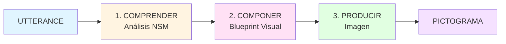

# [PICTOS.NET](https://pictos.net)

## Pictogramas Generativos para la Accesibilidad Cognitiva

[](https://app.netlify.com/projects/pictos/deploys)


**PICTOS** es una herramienta de [investigación doctoral](http://herbertspencer.net/cc) que explora la generación automática de pictogramas a partir de intenciones comunicativas expresadas en lenguaje natural. El proyecto investiga cómo transformar el significado profundo del lenguaje en representaciones visuales universales que faciliten la comunicación para personas con diversidad cognitiva.

Este proyecto avanza sobre [PICTOS.cl](https://pictos.cl) desarrollado por el [Núcleo de Accesibilidad e Inclusión PUCV](https://accesibilidad-inclusion.cl/) enfocado en el desarrollo de apoyos visuales y procedimentales para la interacción accesible con los servicios públicos en Chile.


## Inicio Rápido

### Usar PICTOS.NET
- **Aplicación web**: [pictos.net](https://pictos.net)
- **Tutorial completo**: [Ver Tutorial](docs/TUTORIAL.md) (en castellano)

### Para Desarrolladores
- **Guía de contribución**: [CONTRIBUTING.md](docs/CONTRIBUTING.md)
- **Arquitectura técnica**: [ARCHITECTURE.md](docs/ARCHITECTURE.md)
- **Seguridad**: [SECURITY.md](docs/SECURITY.md)


## ¿Cómo Funciona?

PICTOS utiliza un pipeline de 3 fases que transforma texto en pictogramas:



### Dos Modos de Generación

#### 1. **Modo Cascada** (Automático)
Presiona **▶ Play** para ejecutar el pipeline completo automáticamente. Ideal para generación rápida.

#### 2. **Modo Paso a Paso** (Control Total)
Expande cada utterance para acceder a los 3 bloques interiores:
- **Comprender**: Análisis semántico basado en NSM (65 primitivos universales)
- **Componer**: Elementos jerárquicos y composición espacial
- **Producir**: Renderizado de imagen + Evaluación ICAP

Cada bloque permite inspeccionar, editar y regenerar resultados intermedios.

Ver el [Tutorial completo](docs/TUTORIAL.md) para guía detallada pantalla por pantalla.


## Características Principales

### Almacenamiento Dual: Bitmaps + SVGs

**Bitmaps** (para iteración)
- Almacenados en IndexedDB + localStorage
- Incluyen trazabilidad completa del pipeline (NLU, elementos, prompts, ICAP)
- Exportables como JSON con toda la metadata

**SVGs** (para producción)
- Biblioteca independiente con principio Single Source of Truth (SSoT)
- Solo pictogramas de alta calidad (ICAP ≥ 4.0)
- Metadatos embebidos: NSM, conceptos semánticos, roles, accesibilidad
- Cumplen con [mf-svg-schema](https://github.com/mediafranca/mf-svg-schema)

### Vectorización en Dos Etapas

1. **Trace**: Bitmap PNG → SVG vectorial (vtracer WASM)
2. **Format**: SVG crudo → SVG semántico estructurado (Gemini Pro)

Los SVGs generados son autocontenidos e interoperables.

### Evaluación ICAP

Sistema de evaluación multidimensional con 6 métricas:
- Clarity (Claridad visual)
- Recognizability (Reconocibilidad)
- Semantic Transparency (Transparencia semántica)
- Pragmatic Fit (Ajuste pragmático)
- Cultural Adequacy (Adecuación cultural)
- Cognitive Accessibility (Accesibilidad cognitiva)


## Documentación

### Guías de Usuario
- **[Tutorial Completo](docs/TUTORIAL.md)** - Guía paso a paso en castellano
- **[Configuración del Espacio](docs/TUTORIAL.md#configuración-del-espacio)** - Prompt general, geo-context, modelos
- **[Evaluación ICAP](docs/TUTORIAL.md#evaluación-icap)** - Cómo evaluar pictogramas

### Documentación Técnica
- **[Arquitectura](docs/ARCHITECTURE.md)** - Diseño del sistema, flujo de datos, APIs
- **[Contribuir](docs/CONTRIBUTING.md)** - Guía para desarrolladores
- **[Seguridad](docs/SECURITY.md)** - Políticas y reportes de seguridad

### Esquemas de Investigación (Git Submodules)
- **[NLU Schema](https://github.com/mediafranca/nlu-schema)** - Análisis lingüístico NSM
- **[ICAP](https://github.com/mediafranca/ICAP)** - Visual Communication Index
- **[MF-SVG Schema](https://github.com/mediafranca/mf-svg-schema)** - Pictogramas vectoriales estructurados


## Tecnología

- **Frontend**: React 19 + TypeScript 5.8 + Vite 6
- **Styling**: Tailwind CSS 3.4
- **Modelos IA**:
  - Gemini 3 Pro Preview (NLU, Visual Blueprint, SVG structuring)
  - Gemini 2.5 Flash Image (generación rápida)
  - Gemini 3 Pro Image (alta calidad)
- **Vectorización**: VTracer WASM
- **Almacenamiento**: localStorage + IndexedDB
- **Backend**: Netlify Functions
- **i18n**: Inglés (UK) + Español (Latinoamérica)
- **Licencia**: MIT (código) / CC-BY-4.0 (imágenes)


## Filosofía del Proyecto

### Del Lenguaje Natural a la Imagen

Los pictogramas son **sistemas de comunicación visual** que capturan la esencia semántica de un acto del habla. PICTOS propone un enfoque generativo que:

1. **Comprende profundamente** la intención comunicativa (NSM)
2. **Define la composición** visual jerárquica
3. **Renderiza** la imagen final

Este pipeline reconoce que la comunicación visual efectiva requiere, primero, **comprender qué** se quiere comunicar, antes de decidir **cómo** visualizarlo.

### Fundamentos Teóricos

**Natural Semantic Metalanguage (NSM)**
Descompone cualquier enunciado en 65 primitivos semánticos universales, facilitando la representación visual culturalmente neutra.

**ICAP (Image-Communication Accessibility Protocol)**
Marco de evaluación multidimensional que mide la calidad a través de 6 ejes complementarios. Este índice tiene un repositorio dedicado en [https://github.com/mediafranca/ICAP](https://github.com/mediafranca/ICAP).

Ver [Arquitectura](docs/ARCHITECTURE.md) para detalles técnicos completos.


## Importación y Exportación

### Datos Locales
⚠️ **Importante**: Todos los datos se almacenan localmente en tu navegador.

- Si limpias datos del navegador, perderás tu trabajo
- **Exporta regularmente** tu grafo para respaldos
- Los JSON exportados incluyen imágenes en Base64

### Grafos (RowData)
- **Exportar**: JSON con todos los nodos y metadatos
- **Importar**: Cargar archivos previamente exportados

### SVGs Individuales
- **Descargar**: Archivos `.svg` autocontenidos
- **Compartir**: Envía tu grafo a [hspencer@ead.cl](mailto:hspencer@ead.cl) para contribuir al proyecto


## Casos de Uso

- **Investigación Lingüística**: Analizar correspondencia NSM ↔ elementos visuales
- **Sistemas AAC**: Prototipos rápidos de comunicación aumentativa
- **Educación Especial**: Materiales visuales personalizados
- **Evaluación**: Análisis de pictogramas existentes (ARASAAC, Mulberry, etc.)
- **Desarrollo de Corpus**: Datasets para IA o estudios de percepción
- **Interoperabilidad**: Integración con apps web, sistemas AAC, OER


## Roadmap

### v1.0 (Actual - SVG Generation)

- ✅ Generación vectorial con metadatos semánticos
- ✅ Pipeline Trace + Format
- ✅ Biblioteca SVG independiente (SSoT)
- ✅ Sistema de estilos CSS configurables
- ✅ Filtro ICAP ≥ 4.0

### Próximas Versiones
- Control fino de estilos desde corpus
- Editor visual de SVG con manipulación directa
- Exportación masiva como dataset
- Animaciones SVG basadas en roles semánticos
- Colaboración multiusuario
- API pública

Ver [roadmap completo](docs/ARCHITECTURE.md#roadmap) para más detalles.


## Comunidad y Contribuciones

PICTOS es un proyecto abierto que invita a:

- **Lingüistas** → Refinar análisis NLU y NSM
- **Diseñadores** → Mejorar composición visual y consistencia gráfica
- **Investigadores** → Validar criterios ICAP
- **Desarrolladores** → Extender funcionalidades
- **Usuarios finales** → Reportar necesidades y enviar ejemplos de uso

Lee [CONTRIBUTING.md](docs/CONTRIBUTING.md) antes de contribuir.


## Citar este Proyecto

Si usas PICTOS en tu investigación:

```bibtex
@software{pictos2026,
  title = {PICTOS.NET: Pictogramas Generativos para la Accesibilidad Cognitiva},
  author = {Spencer, Herbert},
  year = {2026},
  url = {https://pictos.net},
  note = {Sistema de generación automática basado en NSM y evaluación ICAP}
}
```


## Reconocimientos

- **Anna Wierzbicka** y **Cliff Goddard** (Natural Semantic Metalanguage)
- **ARASAAC** (Proyecto aragonés de pictogramas) y Sergio Palao
- Comunidad AAC (Augmentative and Alternative Communication)
- Investigadores en accesibilidad cognitiva y diseño universal
- [PICTOS.cl](https://pictos.cl) y [Núcleo de Accesibilidad e Inclusión PUCV](https://accesibilidad-inclusion.cl/)


## Contacto

Para preguntas, sugerencias o colaboraciones:

- **Issues**: Abre un issue en GitHub
- **Pull Requests**: Propón nuevas funcionalidades
- **Email**: [hspencer@ead.cl](mailto:hspencer@ead.cl)
- **Web**: [herbertspencer.net](https://herbertspencer.net)


*PICTOS.NET - Iniciativa de código abierto de [MediaFranca](https://github.com/mediafranca)*

**v1.0.1** - Pictogramas semánticos para la investigación gráfica en lingüística aplicada y accesibilidad cognitiva.
