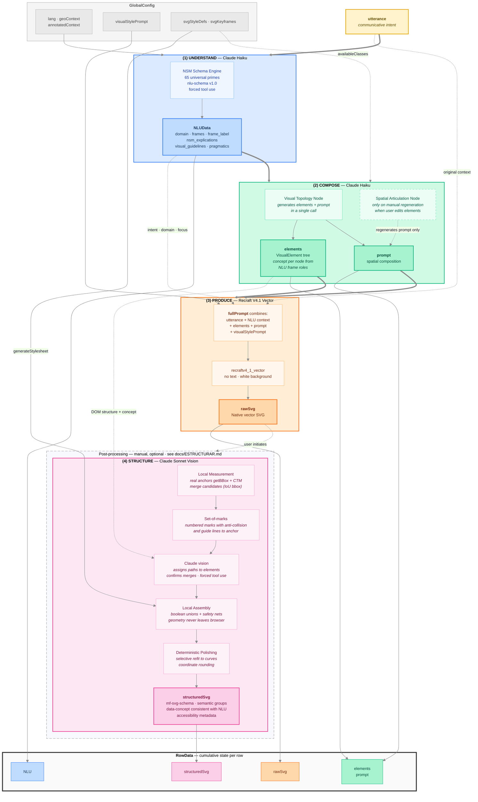
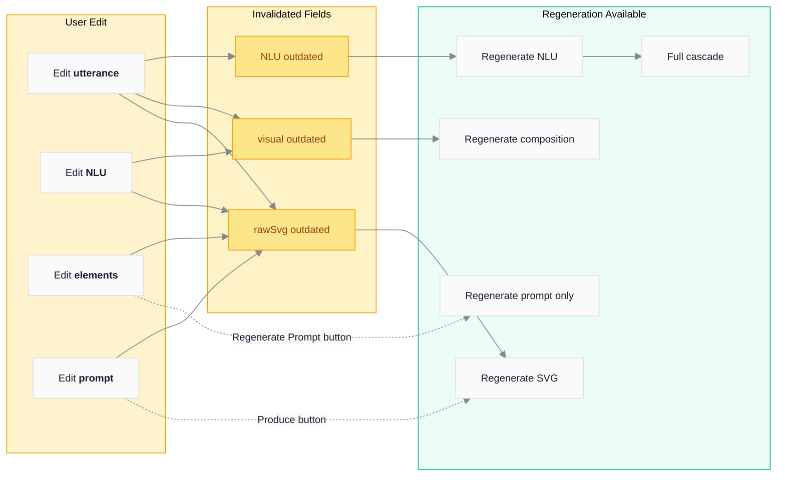

# [PICTOS.NET](https://pictos.net)

**Generative Pictograms for Augmentative and Alternative Communication (AAC)**

* [](https://app.netlify.com/projects/pictos/deploys)
* 
* 

PICTOS.NET transforms communicative intentions expressed in natural language into pictograms using a semantic reasoning pipeline. It is part of the doctoral research of [Herbert Spencer](https://herbertspencer.net/cc) and **[MediaFranca](https://github.com/mediafranca)** — a public good open-source initiative for AAC.

The `dev` development branch contains the next version:

* view: [next.PICTOS.net](https://next.pictos.net)
* [](https://app.netlify.com/projects/pictos-next/deploys)

## How it works

The system implements a pipeline of three automatic phases plus an optional post-processing one. Each phase is visible, editable, and independently regenerable:

**(1) Understand** (Claude Haiku) — Deep linguistic analysis based on Natural Semantic Metalanguage (NSM): 65 universal semantic primitives. It uses forced tool use to ensure valid JSON. It produces a structured schema with communicative intent, domain, semantic roles (FrameNet), and visual instructions.

**(2) Compose** (Claude Haiku) — Translates the NLU analysis into a hierarchy of visual elements (`elements`) and a spatial articulation description (`prompt`). Each element carries a semantic `concept` (Agent, Action, Object, Context) derived from the NLU's frame roles, which travels down to the final SVG's `data-concept`. If the user edits the elements, they can regenerate only the prompt without repeating the entire composition.

**(3) Produce** (Recraft V4.1 Vector) — Generates the pictogram as a native SVG from the semantic context, elements, spatial prompt, and configured visual style. There is no intermediate bitmap: the result is a directly editable vector SVG.

**(4) Structure** (Claude Sonnet, optional) — Reorganizes the raw SVG paths into semantic groups consistent with the hierarchy of phase 2, embedding accessibility metadata according to [mf-svg-schema](https://github.com/mediafranca/mf-svg-schema). It combines local geometric measurement (real anchors via `getBBox` + CTM, pre-calculated merge candidates), a single vision call (set-of-marks with anti-collision and guide lines), local assembly with safety nets, and deterministic geometric polishing: the geometry never leaves the browser nor is it written by the model. Detailed documentation in [docs/ESTRUCTURAR.md](docs/ESTRUCTURAR.md).

The automatic cascade (1 → 2 → 3) runs when creating a new sentence or pressing Play. Phase 4 is optional and initiated manually by the user. Pictograms can be evaluated using the [ICAP](https://github.com/mediafranca/ICAP) framework.

## Detailed Schema



### Feedback Model

Each field is editable. When data is modified, subsequent steps are marked as `outdated`, and the user can selectively regenerate them:



### Global Configuration Parameters

| Parameter | Phase | Status | Description |
|---|---|---|---|
| `lang` | 1, 2, 4 | Active | Language for NLU analysis and element IDs |
| `uiLang` | — | Active | Interface language (independent of NLU) |
| `geoContext` | 1, 4 | Active | Geographic region for contextualization and a11y metadata |
| `annotatedContext` | 1 | Active | Additional context annotated by the user (injected into NLU prompt) |
| `visualStylePrompt` | 3 | Active | Visual style description injected into the Recraft prompt |
| `svgStyleDefs` | 2, 4 | Active | CSS definitions for the SVG (classes available in composition and structuring) |
| `svgKeyframes` | 4 | Active | Animation keyframes for the structured SVG |
| `aspectRatio` | — | Inactive | Was the aspect ratio for Gemini Image; Recraft V4.1 uses a fixed size |
| `imageModel` | — | Inactive | Was the flash/pro selector for Gemini; removed from the pipeline |

---

## Philosophy

Pictograms are more than illustrations: they are communicative acts. PICTOS proposes that to generate a good pictogram, one must first *deeply understand* what is to be communicated, before deciding how to visualize it.

The project stems from a conviction: **visual communication must be explainable and accessible, based on context**.

The generated pictograms aim to reduce cognitive barriers, facilitate the expression of basic needs, and contribute to the autonomy of people with functional diversity.

---

## MediaFranca Ecosystem

PICTOS.NET is part of [MediaFranca](https://github.com/mediafranca), a set of open schemas for augmentative and alternative communication:

| Repository | Description |
|---|---|
| [nlu-schema](https://github.com/mediafranca/nlu-schema) | Deep linguistic analysis schema based on NSM |
| [mf-svg-schema](https://github.com/mediafranca/mf-svg-schema) | Standard for semantic and self-contained SVG pictograms |
| [ICAP](https://github.com/mediafranca/ICAP) | Pictogram evaluation framework (6 cognitive dimensions) |
| [pictos.cl](https://pictos.cl) | Visual support platform for public services (PUCV Accessibility Nucleus) |

`nlu-schema` and `mf-svg-schema` are included as git submodules in this repository.

---

## Usage

**Web application**: [pictos.net](https://pictos.net)

Pictograms and data are stored **locally in the browser** (IndexedDB + localStorage). To back up your work, use **Export Library** — it generates a JSON file with all the images and pipeline metadata.

You can share your exported graph with comments to [contact@pictos.net](mailto:contact@pictos.net).

---

## Local Development

```bash
git clone --recurse-submodules https://github.com/hspencer/pictos-net.git
cd pictos-net
cp .env.example .env        # add ANTHROPIC_API_KEY and RECRAFT_API_KEY
npm install
npm run dev                 # → http://localhost:9001 (netlify dev)
```

Required API keys:
- `ANTHROPIC_API_KEY` — [console.anthropic.com](https://console.anthropic.com)
- `RECRAFT_API_KEY` — [recraft.ai](https://www.recraft.ai/api)
- `GITHUB_TOKEN` — for the pictogram sharing feature (optional)

See [docs/CONTRIBUTING.md](./docs/CONTRIBUTING.md) for full instructions.

---

## Stack

- React 19 + TypeScript 5.8
- Vite 6 + Tailwind CSS 3.4
- Zustand (SVG editor state)
- Anthropic SDK — Claude Haiku 4.5 (phases 1 & 2) + Claude Sonnet 4.6 (phase 4, vision)
- Recraft V4.1 Vector (phase 3, native SVG)
- Netlify Functions (API proxy with JWT) + Netlify Identity
- IndexedDB v3 + localStorage (dual persistence)

---

## Documentation

### Architecture and Development

| Document | Description |
|---|---|
| [docs/ARCHITECTURE.md](./docs/ARCHITECTURE.md) | Technical architecture, data models, services |
| [docs/CONTRIBUTING.md](./docs/CONTRIBUTING.md) | Development guide, submodules, i18n, deployment |
| [docs/SECURITY.md](./docs/SECURITY.md) | API key management, security considerations |
| [docs/PIPELINE_MIGRATION_CLAUDE_RECRAFT.md](./docs/PIPELINE_MIGRATION_CLAUDE_RECRAFT.md) | Notes on the Gemini → Claude + Recraft migration (v1.x → v2.0) |

### User Interface

| Document | Description |
|---|---|
| [docs/UI_MAP.md](./docs/UI_MAP.md) | Structural map of the UI: all semantic IDs |
| [docs/UI_CONVENTIONS.md](./docs/UI_CONVENTIONS.md) | Design conventions: colors, typography, z-index |
| [docs/CSS_STYLING_ARCHITECTURE.md](./docs/CSS_STYLING_ARCHITECTURE.md) | Two-level model for SVG styles (classes + local overrides) |
| [docs/WCAG_ROADMAP.md](./docs/WCAG_ROADMAP.md) | WCAG 2.1 AA compliance status and accessibility roadmap |

---

## Community

PICTOS invites **linguists** to refine NLU and NSM analysis, **designers** to improve visual composition, **educators and psychologists** to imagine new use cases, **researchers** to validate quality metrics, and **developers** to extend functionalities.

Contributions are welcome. Report bugs, propose features, or open a Pull Request on GitHub.

---

## Citation

```
Spencer, H. (2026). PICTOS.NET: Generative pictograms for cognitive accessibility.
MediaFranca. https://pictos.net
```

*License: Apache 2.0 (code) · CC-BY-4.0 (generated pictograms, per user's choice)*
