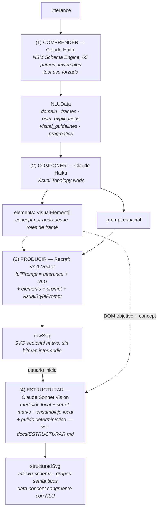

# PICTOS.NET — Documentación de Arquitectura

**Pictogramas generativos para la Comunicación Aumentativa y Alternativa (CAA)**

Actualizado: 2026-07-23

## Tabla de contenidos

1. [Visión general](#1-visión-general)
2. [Estructura del repositorio](#2-estructura-del-repositorio)
3. [Stack tecnológico](#3-stack-tecnológico)
4. [Pipeline de generación](#4-pipeline-de-generación)
5. [Modelos de datos](#5-modelos-de-datos)
6. [Servicios](#6-servicios)
7. [Componentes](#7-componentes)
8. [Almacenamiento](#8-almacenamiento)
9. [Configuración](#9-configuración)
10. [Build y deployment](#10-build-y-deployment)

## 1. Visión general

PICTOS.NET transforma intenciones comunicativas en lenguaje natural en pictogramas SVG semánticos mediante un pipeline de razonamiento en 4 fases. Es una herramienta de investigación doctoral orientada a profesionales de la CAA (fonoaudiólogos, educadores especiales, psicólogos) que trabajan con personas con diversidad funcional comunicativa.

### Principios de diseño

- **Explicabilidad**: cada fase es visible, editable y regenerable de forma independiente
- **Semántica persistente**: los SVG exportados son autocontenidos con metadatos accesibles embebidos
- **Privacidad**: datos almacenados localmente (IndexedDB), sin servidor propio de datos
- **Seguridad por diseño**: ninguna API key llega al navegador; todas las llamadas a servicios externos pasan por Netlify Functions autenticadas

## 2. Estructura del repositorio

```
pictos-net/
├── App.tsx                        # Componente raíz, orquestación del pipeline
├── types.ts                       # Tipos TypeScript globales
├── vite.config.ts
├── tailwind.config.js
├── package.json
│
├── services/
│   ├── claudeService.ts           # Fases 1+2 (NLU, composición) y spatial regen
│   ├── recraftService.ts          # Fase 3 (SVG vectorial nativo)
│   ├── svgStructureService.ts     # Fase 4 (estructuración semántica)
│   ├── aiClient.ts                # Proxy siempre-server: callClaude(), callRecraft()
│   ├── vtracerService.ts          # VTracer WASM (presente; no en cascada automática)
│   ├── indexedDBService.ts        # Capa de persistencia (IndexedDB v3)
│   ├── svgMergeCandidates.ts      # Detección de contornos dobles (módulo puro)
│   ├── svgPathPolish.ts           # Pulido geométrico determinístico (módulo puro)
│   ├── svgTreeUtils.ts            # Utilidades de árbol SVG (módulo puro)
│   ├── svgGeometryUtils.ts        # Geometría SVG (módulo puro)
│   └── geocodingService.ts        # Geocodificación para contexto geográfico
│
├── stores/
│   └── svgEditorStore.ts          # Zustand: overrideMap, libraryValues, history, viewport
│
├── hooks/
│   ├── useDialogA11y.ts           # Focus trap + Escape para modales
│   ├── useSVGLibrary.ts           # Gestión de la librería de SVGs
│   └── useTranslation.ts          # i18n hook (en-GB / es-419)
│
├── components/
│   ├── SVGGenerator.tsx           # UI de generación SVG por fila
│   ├── SVGThumbnail.tsx           # Miniatura de pictograma
│   ├── GeoAutocomplete.tsx        # Input de contexto geográfico
│   ├── VectorizerModal.tsx        # Modal bitmap→SVG (vtracer WASM, acceso manual)
│   ├── PictoForge/
│   │   └── StyleEditor.tsx        # Editor de estilos CSS para SVG
│   ├── SVGEditor/
│   │   ├── SVGEditorModal.tsx     # Modal editor SVG semántico (fullscreen)
│   │   ├── SVGCanvas.tsx          # Viewport zoom/pan con selección de elementos
│   │   ├── SemanticTree.tsx       # Árbol de capas del SVG
│   │   ├── StylePanel.tsx         # Panel de propiedades y estilos
│   │   ├── StylePickerModal.tsx   # Modal selector de clases CSS
│   │   ├── SelectionToolbar.tsx   # Toolbar contextual de selección
│   │   └── BoundingBox.tsx        # Caja de selección visual
│   └── ui/
│       ├── button.tsx
│       └── input.tsx
│
├── utils/
│   ├── svgAccessibility.ts        # Inyección de <title>, <desc>, role="img"
│   └── styleUtils.ts              # Parse/serialize de reglas CSS del SVG
│
├── lib/
│   ├── style-editor/              # Librería interna de edición de estilos
│   │   ├── lib/constants.ts       # INITIAL_STYLES
│   │   └── lib/keyframeConstants.ts # INITIAL_KEYFRAMES
│   └── vtracer-wasm/              # WASM bundle (visioncortex vtracer-webapp)
│       └── vtracer_webapp_bg.wasm
│
├── locales/
│   ├── en-GB.json                 # Traducciones inglés
│   └── es-419.json                # Traducciones español latinoamericano
│
├── netlify/
│   ├── functions/                 # Proxies server-side (Claude, Recraft, Gemini, quota)
│   └── edge-functions/            # (reservado)
│
├── schemas/                       # Fuentes canónicas, directorios normales
│   ├── nlu-schema/                # Contratos NLU versionados + validadores + tests
│   ├── pictogram-composition-schema/ # Contrato de composición + tests
│   ├── mf-svg-schema/             # Esquema para pictogramas SVG estructurados
│   └── ICAP/                      # Recurso histórico opcional (puede no existir)
│
├── public/
│   ├── wasm/vtracer/              # WASM binary servido estáticamente
│   ├── libraries/                 # Bibliotecas de ejemplo (.json)
│   └── schemas/                   # Copias de schemas para acceso web
│
└── docs/                          # Documentación técnica
```

## 3. Stack tecnológico

| Capa | Tecnología | Versión |
|------|-----------|---------|
| UI Framework | React | 19 |
| Tipado | TypeScript | ~5.8 |
| Build | Vite | ^6 |
| Estilos | Tailwind CSS | 3.4 |
| Iconos | Lucide React | — |
| Drag & drop | @dnd-kit | — |
| Compresión de descarga | JSZip | — |
| AI — fases 1, 2, 4 | Anthropic Claude (Haiku 4.5 / Sonnet 4.6) | via proxy |
| AI — fase 3 | Recraft V4.1 Vector | via proxy |
| AI — fase 3 alternativo | Gemini imagen (Vertex AI) | via proxy |
| Vectorización local | vtracer-webapp WASM (visioncortex) | 0.4.0 |
| Persistencia | IndexedDB (nativo) + localStorage | — |
| Hosting / Functions | Netlify | — |
| i18n | Hook personalizado | — |

## 4. Pipeline de generación

3 fases automáticas (1→2→3) + 1 fase opcional iniciada por el usuario (4). La antigua fase VECTORIZAR (VTracer) fue eliminada de la cascada: Recraft V4.1 entrega SVG nativo; VTracer sigue disponible manualmente.



### Acumulación en RowData

Cada fila acumula los resultados progresivamente:

```
RowData = { utterance, NLU, elements, prompt, bitmap?, rawSvg, structuredSvg }
```

Ningún campo se sobreescribe automáticamente al regenerar una fase posterior. El usuario controla qué fases regenerar.

### Invalidación en cascada

| Edición | Invalida |
|---------|---------|
| utterance | NLU → elements → prompt → rawSvg |
| NLU | elements → prompt → rawSvg |
| elements | prompt → rawSvg |
| prompt | rawSvg |
| rawSvg | structuredSvg |

## 5. Modelos de datos

### RowData

```typescript
interface RowData {
  id: string;
  UTTERANCE: string;
  NLU?: NLUData;
  elements?: VisualElement[];
  prompt?: string;
  bitmap?: string;               // base64 (solo modelos Gemini imagen)
  rawSvg?: string;               // output fase 3, sin semántica
  structuredSvg?: string;        // output mf-svg-schema, autocontenido
  shared?: boolean;

  nluStatus: StepStatus;
  visualStatus: StepStatus;
  bitmapStatus: StepStatus;

  nluDuration?: number;
  visualDuration?: number;
  bitmapDuration?: number;
}

type StepStatus = 'idle' | 'processing' | 'completed' | 'error' | 'outdated';
```

### NLUData (nlu-schema v1.0)

```typescript
interface NLUData {
  utterance: string;
  lang: string;
  metadata: { speech_act: string; intent: string };
  domain: string;
  frame_name: string;
  frame_label: string;
  frames: NLUFrame[];
  nsm_explications: Record<string, string>;
  logical_form: { event: string; modality: string };
  pragmatics: { politeness: string; formality: string; expected_response: string };
  visual_guidelines: {
    focus_actor: string;
    action_core: string;
    object_core: string;
    context: string;
    temporal: string;
  };
}
```

### VisualElement

```typescript
interface VisualElement {
  id: string;        // snake_case, sustantivo en el idioma del utterance
  concept?: string;  // Root | Agent | Action | Object | Context | Element
  children?: VisualElement[];
}
```

### GlobalConfig (campos activos)

```typescript
interface GlobalConfig {
  lang: string;                  // ISO 639 (ej: 'es-419')
  uiLang: string;                // Idioma de la UI (independiente del NLU)
  generationModel: string;       // Modelo fase 3 (default: 'gemini-2.5-flash-image')
  phase5Model: string;           // Modelo fase 4 (default: 'claude-sonnet-4-6')
  author: string;
  license: string;
  visualStylePrompt: string;
  geoContext?: { lat: string; lng: string; region: string };
  annotatedContext?: string;
  svgStyleDefs?: StyleDefinition[];
  svgKeyframes?: KeyframeDefinition[];
}
```

## 6. Servicios

### claudeService.ts

Integración con la API de Anthropic (fases 1, 2 y regeneración de prompt). Todas las llamadas van vía `aiClient.callClaude()` al proxy `api-claude`.

| Función | Fase | Modelo |
|---------|------|--------|
| `generateNLU(utterance, config)` | 1 — COMPRENDER | Haiku 4.5 |
| `generateElements(nlu, config)` | 2 — COMPONER | Haiku 4.5 |
| `generateSpatialPrompt(nlu, elements, config)` | 2 — regen prompt | Haiku 4.5 |

### recraftService.ts

Integración con Recraft V4.1 Vector (fase 3). Las llamadas van vía background worker y poll:

- `api-recraft-worker-background` — genera la imagen, escribe a Blob store
- `api-recraft-poll` — el cliente sondea el resultado

Modelo: `recraftv4_1_vector` (default) y variantes. V4.1 no soporta `style_id` — la consistencia visual depende exclusivamente del prompt y `visualStylePrompt`.

### svgStructureService.ts

Estructuración semántica del SVG crudo (fase 4). Referencia completa: [ESTRUCTURAR.md](ESTRUCTURAR.md).

Pipeline interno: pre-proceso local → una sola llamada de visión (`api-claude`) → ensamblaje local → pulido determinístico. La geometría nunca la escribe el modelo.

**Módulos puros testeables** (`node --test`): `svgMergeCandidates.ts`, `svgPathPolish.ts`, `svgTreeUtils.ts`, `svgGeometryUtils.ts`.

### aiClient.ts

Proxy siempre-server. Nunca llama a servicios externos directamente desde el navegador.

```typescript
callClaude(body)    // → /.netlify/functions/api-claude
callRecraft(body)   // → /.netlify/functions/api-recraft-worker-background
```

### indexedDBService.ts

Base de datos `pictonet_storage` v3, tres stores:

| Store | Contenido |
|-------|-----------|
| `rows` | RowData sin campos binarios |
| `bitmaps` | `{ id, bitmap: string }` — PNG→JPEG q=0.75 al escribir |
| `svgs` | `{ id, rawSvg?, structuredSvg? }` |

## 7. Componentes

### Jerarquía

```
App.tsx
├── Header (#toolbar)
│   ├── SearchComponent
│   ├── Library dropdown
│   ├── Settings button → #globalSettings panel
│   └── Console button → #console-panel
│
├── Main (#mainContent)
│   ├── Home view (#home-view)
│   └── List view (#list-view)
│       └── RowComponent × N
│           ├── row header (utterance, badges, thumbnail, cascade control)
│           └── row detail (3 StepBoxes)
│               ├── #block-nlu → SmartNLUEditor
│               ├── #block-compose → ElementsEditor + PromptRenderer
│               └── #block-produce → SVGGenerator
│
└── Modales (portales, z-index 50+)
    ├── FocusViewModal       — detalle fullscreen de cada fase
    ├── StyleEditor          — editor de clases CSS del sistema visual
    ├── SVGEditorModal       — editor semántico fullscreen del SVG estructurado
    │   ├── SemanticTree     — árbol de capas
    │   ├── SVGCanvas        — viewport zoom/pan
    │   ├── StylePanel       — propiedades y clases CSS
    │   └── StylePickerModal — selector de estilos de biblioteca
    └── VectorizerModal      — vectorizador bitmap→SVG con controles vtracer (manual)
```

## 8. Almacenamiento

### Arquitectura dual

**IndexedDB** (`pictonet_storage` v3) — datos binarios y pipeline:
- Filas (metadata sin binarios), bitmaps, SVGs
- Persiste entre sesiones, sobrevive recarga de página
- Los bitmaps se comprimen a JPEG q=0.75 al guardar

**localStorage** — solo configuración:
- Clave: `pictonet_v19_config`
- Contiene: `GlobalConfig`

### Exportación

- **Exportar librería** → JSON con todos los rows + bitmaps base64 embebidos
- **Exportar SVGs** → ZIP con todos los `structuredSvg` como archivos `.svg` individuales

### Limpiar datos (troubleshooting)

```javascript
// Consola del navegador
indexedDB.deleteDatabase('pictonet_storage')
localStorage.removeItem('pictonet_v19_config')
```

## 9. Configuración

### Variables de entorno

```bash
ANTHROPIC_API_KEY=<Anthropic API Key>
RECRAFT_API_KEY=<Recraft API Key>
GOOGLE_SERVICE_ACCOUNT_JSON=<JSON en una línea — Vertex AI>
```

Necesarias en `.env` para desarrollo local. En producción se inyectan en Netlify como variables de entorno server-side. El bundle del cliente no contiene ninguna key. Ver [SECURITY.md](./SECURITY.md).

### GlobalConfig por defecto

```typescript
{
  lang: 'es-419',
  uiLang: 'es-419',
  generationModel: 'gemini-2.5-flash-image',
  phase5Model: 'claude-sonnet-4-6',
  author: 'PICTOS.NET',
  license: 'CC BY 4.0',
  visualStylePrompt: 'Siluetas sobre fondo blanco plano...',
  geoContext: { lat: '-33.4489', lng: '-70.6693', region: 'Santiago, CL' }
}
```

## 10. Build y deployment

```bash
npm run dev          # copy-schemas + optimize-thumbs + netlify dev → http://localhost:9001
npm run build        # copy-schemas + optimize-thumbs + vite build → dist/
npx tsc --noEmit     # verificación de tipos
npm run validate-i18n # consistencia de traducciones
```

El servidor de desarrollo usa `netlify dev` (no `vite` directamente) para que las Netlify Functions estén disponibles en local. El puerto de la app es **9001**; Vite interno corre en 3000 y el proxy reenvía `/.netlify/*` a 9001.

### Deployment automático

| Branch | Deploy | URL |
|--------|--------|-----|
| `main` | Netlify auto | pictos.net |
| `dev` | Netlify auto | next.pictos.net |

Flujo: `dev` → `main` (fast-forward).

### Productos de esquemas

PictoNet es la fuente canónica de NLU, composición y SVG semántico. Los tres se desarrollan y
comitean en `schemas/` como parte del repositorio. La exportación independiente
conserva sus archivos, pruebas y versiones, y registra el commit fuente y hashes.
No se usan gitlinks ni actualizaciones automáticas desde repositorios externos.

`postinstall` copia solo contratos `*.schema.json` públicos a `public/schemas/`;
no publica repositorios ni paquetes. La preparación local y las puertas humanas
para publicar están documentadas en [SCHEMA_PUBLICATION.md](SCHEMA_PUBLICATION.md).

## Referencias cruzadas

| Documento | Cubre |
|-----------|-------|
| `docs/CONTRIBUTING.md` | Setup local, esquemas canónicos, i18n, flujo de contribución |
| `docs/SECURITY.md` | Modelo de seguridad, API keys, proxies, headers |
| `docs/ESTRUCTURAR.md` | Fase 4: pipeline interno, set-of-marks, geometría local |
| `docs/CSS_STYLING_ARCHITECTURE.md` | Modelo de estilos SVG (dos niveles, overrides) |
| `docs/UI_MAP.md` | IDs semánticos de la interfaz |
| `docs/UI_CONVENTIONS.md` | Reglas de diseño, tokens, componentes |
| `docs/WCAG_ROADMAP.md` | Estado de conformidad WCAG 2.1 AA |
| `docs/BATCH_GENERATION_DESIGN.md` | Generación en lote (Vertex AI Batch API) |

*Licencia: Apache 2.0 (código) · CC-BY-4.0 (pictogramas generados)*
