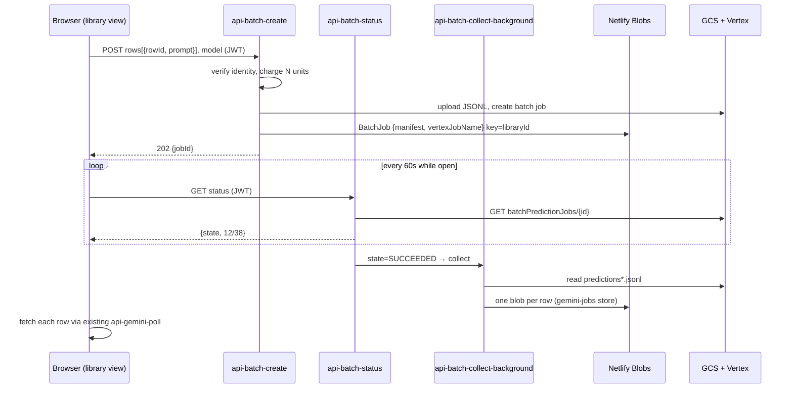

# Batch Generation Design (Vertex AI Batch API)

Companion to `specs/batch-generation.allium`. The spec defines behaviour; this
document records the verified API mechanics, the architecture mapping, and the
operational setup required in Google Cloud.

## Why

Vertex Gemini image models run on dynamic shared quota: online generation
returns transient 429 under burst or congestion and there is no per-project
quota to raise. The Batch API sidesteps rate limits entirely (dynamically
allocated shared pool, jobs queue instead of failing) and costs 50% of online
inference. The trade-off is turnaround: most jobs finish within minutes to
hours (24h worst case running, 72h max queued, no SLA). Batch is therefore a
"generate the library overnight" mode, not a live-demo mode.

## Verified API mechanics

Facts confirmed against the Google Cloud documentation (June 2026)[^1].

Input: one JSONL file in Cloud Storage, max 1 GB, up to 200,000 lines. Each
line wraps a standard generateContent request:

```json
{"request": {"contents": [{"role": "user", "parts": [{"text": "PROMPT"}]}], "generationConfig": {"responseModalities": ["IMAGE"], "imageConfig": {"aspectRatio": "1:1"}}}}
```

Image output in batch is capped at 1K resolution (2K/4K unsupported), which
matches what the online worker already requests.

Job creation: `POST https://aiplatform.googleapis.com/v1/projects/{P}/locations/global/batchPredictionJobs`
with model `publishers/google/models/gemini-2.5-flash-image`, `inputConfig.gcsSource.uris`
pointing at the JSONL and `outputConfig.gcsDestination.outputUriPrefix` at the
output folder. The global endpoint is supported for base models.

Polling: `GET .../batchPredictionJobs/{ID}` returns `state`
(`JOB_STATE_PENDING | RUNNING | SUCCEEDED | FAILED | CANCELLED | PAUSED`) and
`completionStats {successfulCount, failedCount}`. Completed lines are exported
continuously; a job cancelled at the 24h mark still delivers finished rows,
and only completed inferences are billed.

Output: JSONL files under the output prefix. Each line carries
`{status, processed_time, request, response}` where `response` is a full
generateContent response (image as `inlineData` base64) and `status` holds the
per-line error string when the line failed. There is **no custom id field**:
the only correlation key is the echoed `request`, hence the content-based
manifest (sha256 of each prompt) in the spec.

## Architecture mapping



Key decisions, mirrored in the spec:

The BatchJob blob (store `batch-jobs`, key = libraryId) is the single source
of truth, so the job survives browser sessions and devices; the client only
keeps a pointer and resumes polling on load. The collector never returns
image bytes to the client: it writes one blob per row into the existing
`gemini-jobs` store (`batch-{jobId}-{rowId}`), and the client drains results
through the already-hardened `api-gemini-poll` path. Quota charges
`rows.count` units at submission via the existing `checkAndCharge`. One
active job per library. Batch supports only Gemini image models (Recraft has
no batch API).

## Google Cloud setup (one-time, manual)

1. Create a bucket in `pictos-vertex` (single region or US multi-region):
   `gsutil mb -p pictos-vertex gs://pictos-vertex-batch`
2. Give the Vertex AI service agent access to it (input read + output write):
   `gsutil iam ch serviceAccount:service-{PROJECT_NUMBER}@gcp-sa-aiplatform.iam.gserviceaccount.com:roles/storage.objectAdmin gs://pictos-vertex-batch`
3. Give `pictos-vertex-sa` (the SA in `GOOGLE_SERVICE_ACCOUNT_JSON`) object
   admin on the same bucket:
   `gsutil iam ch serviceAccount:pictos-vertex-sa@pictos-vertex.iam.gserviceaccount.com:roles/storage.objectAdmin gs://pictos-vertex-batch`
4. Verify the SA can create batch jobs (role Vertex AI User covers
   `aiplatform.batchPredictionJobs.*`; if creation returns 403, add it).
5. Recommended: bucket lifecycle rule deleting objects older than 7 days, and
   disable soft delete (Google warns of surprise storage charges otherwise).
6. New Netlify env var: `VERTEX_BATCH_BUCKET=pictos-vertex-batch`.

Custom service accounts are not supported by batch jobs themselves; the job
runs under Google's AI Platform service agent, which is why step 2 exists.

## Sequence batch and visual anchors (Phase 2.5)

Batching a sequence is a different gesture from batching a library: the
library button is logistic (produce many, cheap, overnight); the sequence
button is semantic. Because the batch assembles every JSONL line in a single
act, it can inject a shared preamble into each line that row-by-row online
generation cannot provide: the same recurring character described once
(appearance, age, clothing), a fixed palette, the recurring objects and
setting of the transaction, plus the step position ("Step 4 of 10 in the
sequence 'Postulación SAE'").

The anchors come from one extra Claude call before submission — a Phase 2.5
(`derive_sequence_anchors`, 0 quota units since api-claude is free) that
reads all utterances of the sequence and writes the shared visual bible.
Phase 1 semantics are untouched: utterances remain self-contained (see
LIBRERIA_TALLER.md rule 7); consistency travels to Phase 3 only. The
manifest hashes the composed prompt (anchors + position + row prompt), since
that is the text Vertex echoes back.

Two open questions worth flagging: consistency by reference image (two-pass
batch using `fileData` gs:// URIs — more robust than textual anchors) and
anchor authorship (machine proposes vs. professional edits vs. end-user
likeness), the latter being a doctoral control-point question. Both tracked
in the spec.

## UX sketch

Two entry points. Library view gains "Generar librería en lote" (enabled
when 1+ rows have a Phase 2 prompt and no batch is active); the sequence
editor toolbar gains "Generar secuencia en lote", which runs Phase 2.5 and
shows the derived anchors in the confirmation dialog. The confirmation
states the unit cost, the 50% discount and the "minutes to hours, up to 24h"
expectation. A persistent status chip on the library header shows queue/run
progress from `completionStats` ("Lote: generando 12/38") and survives
reloads. On completion, rows fill in with the standard completed/error
states; failed rows show the per-line Vertex error and can be retried
online.

## Out of scope for v1

Incremental collection of partial output while the job runs (open question in
the spec), BigQuery input/output, batch for structuring (Phase 4), and any
Recraft batching.

[^1]: Pages "Batch inference with Gemini" and "Create a batch job with Cloud
Storage", docs.cloud.google.com, retrieved 2026-07-03. Gemini 2.5 Flash Image
GA release notes confirm batch prediction support for image generation.
