# ESTRUCTURAR — del trazado crudo al SVG semántico

Documento de referencia de la fase 4 del pipeline (opcional, iniciada por el usuario). Describe el enfoque vigente tras la serie de mejoras de julio 2026: congruencia semántica con las fases de comprensión y composición, medición geométrica local, candidatos de fusión pre-calculados y pulido determinístico.

Implementación: `services/svgStructureService.ts`, con módulos puros testeables en `services/svgMergeCandidates.ts` y `services/svgPathPolish.ts`.

## Principios

1. **La geometría nunca la escribe el modelo.** El modelo de visión solo asigna ids de paths a nodos semánticos y confirma fusiones; toda manipulación de coordenadas (uniones booleanas, simplificación, redondeo) se calcula localmente en el navegador. Esto elimina la varianza destructiva que retiró al modo redibujo[^1].
2. **El DOM resultante es congruente con COMPRENDER y COMPONER.** Cada `<g>` corresponde a un nodo del árbol `VisualElement` compuesto en la fase 2, y su `data-concept` proviene de los roles de frame del NLU — no se re-adivina desde el texto del id.
3. **Preservar es la prioridad.** Ante la duda, un path se conserva (o se fusiona); perder un elemento visible es un error grave, dejar una mota menor es tolerable. Las redes de seguridad del ensamblado hacen imposible el pictograma en blanco.
4. **Todo lo que pueda calcularse localmente, se calcula localmente.** El modelo recibe evidencia pre-digerida (anclas medidas, candidatos de fusión) y se limita a decidir lo que requiere juicio visual.

## Pipeline interno

```mermaid
%%{init: {
  'theme': 'base',
  'themeVariables': {
    'primaryColor': '#fce7f3',
    'primaryTextColor': '#1a1a2e',
    'primaryBorderColor': '#ec4899',
    'lineColor': '#888',
    'fontSize': '13px',
    'fontFamily': 'Lexend, system-ui, sans-serif'
  },
  'flowchart': { 'padding': 16, 'nodeSpacing': 30, 'rankSpacing': 40, 'curve': 'basis' }
}}%%
flowchart TD
    IN["<b>rawSvg</b> + elements (con concept)<br>+ NLU + GlobalConfig<br>+ bitmap de referencia (opcional)"]

    subgraph LOCAL1["Pre-proceso local (sin API)"]
        direction TB
        ids["ensurePathIds<br><i>ids estables p0, p1…</i>"]
        inv["buildPathInventory<br><i>fills, clases, fondo excluido</i>"]
        anchors["measurePathAnchors<br><i>getBBox + cadena CTM<br>+ isPointInPath (grilla 7×7)</i>"]
        cand["detectMergeCandidates<br><i>IoU bbox ≥ 0.7 · razón áreas ≥ 0.4<br>mismo fill-role · union-find</i>"]
        marks["rasterizeWithMarks<br><i>marcas numeradas + anti-colisión<br>+ líneas guía al ancla real</i>"]
    end

    subgraph MODEL["Una sola llamada de visión"]
        direction TB
        vision["restructure_svg (tool use forzado)<br><i>imagen A: bitmap limpio (verdad visual)<br>imagen B: trazado numerado (coordenadas)<br>+ DOM objetivo + paleta CSS<br>+ candidatos de fusión a confirmar</i>"]
        mapping["<b>StructuringMapping</b><br>groups (keep · cssClass · parentId<br>· merge.sources) + discard"]
    end

    subgraph LOCAL2["Ensamblado local (sin API)"]
        direction TB
        merge["resolveMergeGeometry<br><i>unión Martinez + applySimplify<br>solo sources del modelo</i>"]
        safety["Redes de seguridad<br><i>huérfanos reparentados a top-level<br>descartes no micro-blob revertidos<br>fallback plano si estructura vacía</i>"]
        render["renderGroup<br><i>data-concept desde el mapa NLU<br>aria-label · clases de paleta</i>"]
        post["Post-proceso<br><i>CSS filtrado a clases usadas<br>metadata mf-svg (con visualDom)<br>deriveChildIds · polishGeometry</i>"]
    end

    OUT["<b>structuredSvg</b><br>mf-svg-schema · grupos semánticos<br>congruentes con el árbol compuesto"]

    IN --> LOCAL1
    ids --> inv --> anchors --> cand --> marks
    LOCAL1 --> MODEL
    vision --> mapping
    MODEL --> LOCAL2
    merge --> safety --> render --> post
    LOCAL2 --> OUT

    style IN fill:#fed7aa,stroke:#f97316,stroke-width:2px,color:#7c2d12
    style OUT fill:#fbcfe8,stroke:#ec4899,stroke-width:2px,color:#831843
    style LOCAL1 fill:#f0fdf4,stroke:#22c55e
    style LOCAL2 fill:#f0fdf4,stroke:#22c55e
    style MODEL fill:#fdf2f8,stroke:#ec4899
```

## Congruencia semántica con las fases 1 y 2

La fase 2 (COMPONER) emite, por cada elemento del DOM visual, un campo `concept` derivado de los roles de frame del análisis NLU:

| Concept | Origen en el NLU |
|---|---|
| `Root` | solo el nodo raíz `pictograma` |
| `Agent` | roles Agent, Experiencer, Speaker, Addressee |
| `Action` | la representación visual del `lexical_unit` (gesto, líneas de movimiento) |
| `Object` | roles Patient, Theme, Object, Instrument, Beneficiary |
| `Context` | roles Location, Time; escenario y fondo |
| `Element` | todo lo que no mapea a un rol de frame |

Ese `concept` viaja por `VisualElement` hasta el atributo `data-concept` de cada `<g>` del SVG estructurado y hasta `metadata.visualDom` (árbol aplanado id → concept → parentId), de modo que el artefacto final es auditable contra la composición que lo originó. Para filas creadas antes de este cambio existe un fallback legacy que adivina el concept por prefijo del id (`guessConceptFromId`), usado solo cuando el campo no está presente.

## Medición de anclas y set-of-marks

El promedio ingenuo de los números del atributo `d` (centroide legacy) fallaba con comandos relativos y arcos, ubicando marcas lejos de su path. El método vigente:

1. Se monta el SVG en un host oculto del DOM (`visibility:hidden`, nunca `display:none`, porque `getBBox` requiere layout).
2. Cada `path[id]` se mide con `getBBox()` y el resultado se transforma al espacio del viewBox por la cadena CTM completa (`getScreenCTM`), lo que soporta `translate`, `scale`, `matrix` y rotaciones.
3. Si el centro de la caja cae fuera del relleno (formas en C, anillos), se muestrea una grilla de 7×7 con `Path2D.isPointInPath` respetando `fill-rule`, y gana el punto interior más cercano al centro: la marca queda sobre la figura que etiqueta.
4. En la rasterización, las marcas que colisionan (paths concéntricos) se separan por relajación iterativa; las desplazadas dibujan una línea guía roja hasta su ancla real, convención que el prompt del sistema explica al modelo.

## Candidatos de fusión

Los contornos dobles (borde interno y externo de una misma línea trazada) se detectan antes de llamar al modelo: pares de paths con el mismo `fill-role`, IoU de bbox ≥ 0.7 y razón de áreas ≥ 0.4, agrupados transitivamente (union-find) en conjuntos de dos o más. El prompt los presenta como candidatos a verificar contra la imagen: el modelo confirma o rechaza en `merge.sources`, y conserva la libertad de proponer fusiones no listadas. La unión geométrica exacta siempre se calcula localmente (sweep-line de Martinez sobre los paths absolutizados, luego refit a curvas con `applySimplify`).

## Pulido geométrico determinístico

Tras el ensamblado y `deriveChildIds`, `polishGeometry` recorre cada `<path>`:

1. **Refit selectivo a curvas.** Solo los paths "polyline-pesados" (≥ 24 segmentos con ≥ 60 por ciento de líneas rectas — la firma del ruido de trazado) pasan por `applySimplify`. Los paths ya suaves (salida nativa de Recraft) no se tocan, así el pulido no puede degradar geometría limpia.
2. **Redondeo de coordenadas** a 1 decimal (sub-0.1px en viewBox 1024): elimina precisión sin significado y reduce el tamaño del archivo.

Cada `d` reescrito se valida; ante cualquier fallo se conserva el original. La heurística de selección y el redondeo viven en `svgPathPolish.ts` (módulo puro, con tests).

## Redes de seguridad del ensamblado

El ensamblado desconfía sistemáticamente del modelo en los casos donde equivocarse borra contenido visible:

1. **Grupos huérfanos**: un `parentId` que apunta a un nodo inexistente dejaría todo el subárbol sin renderizar; se reparenta a top-level.
2. **Descartes sospechosos**: un path descartado que no es micro-mancha (área real en el viewBox) se ignora del descarte y fluye al rescate de huérfanos, terminando visible en un grupo `contexto`.
3. **Estructura vacía**: si tras todos los rescates no queda nada renderizable, se emite un grupo plano con todos los paths no-fondo. Visible y sin estructura es mejor que invisible.

## Modo redibujo (experimental, retirado como default)

`redrawSVG` pide al modelo autorar un SVG limpio desde la imagen de referencia. Quedó retirado del flujo por alta varianza: funciona en formas triviales pero destruye pictogramas multi-elemento[^1]. El camino planificado para recuperarlo es el redibujo restringido por grupo con verificación local (ver roadmap).

## Roadmap restante

Los pasos 1 a 4 del plan de julio 2026 están implementados (congruencia semántica, anclas reales y anti-colisión, candidatos de fusión, pulido determinístico). Quedan:

1. **Paso 5 — Verificación visual automática.** Rasterizar el SVG estructurado y compararlo contra el bitmap de referencia (diff por región, IoU por grupo). Da la métrica de calidad de agrupación sobre corpus y es prerequisito del paso 6.
2. **Paso 6 — Redibujo restringido por grupo.** Redibujar un grupo a la vez con su recorte raster como referencia, aceptando el resultado solo si supera un umbral de IoU contra el original; si no, conservar el trazo. Es la vía hacia "elegantemente dibujado" sin la varianza del redibujo global.
3. **Paso 7 — Artefacto de distribución.** `exportSvgForDistribution()`: separar el SVG de trabajo (tabindex en grupos para el editor) del SVG final para AAC (`aria-hidden` en decorativos, ids únicos por instancia, `<desc>` en lenguaje natural). Detallado en el Experimento E del roadmap histórico[^2].
4. **Paso 8 — Consolidación documental** de los resultados de los pasos 5 a 7.

[^1]: La decisión y su justificación están comentadas en `redrawSVG` (`services/svgStructureService.ts`): el redibujo global autoraba geometría a ciegas y destruía pictogramas limpios de varios elementos.
[^2]: `docs/ROADMAP_ESTRUCTURAR.md` es el plan de optimización de marzo 2026, anterior a la migración a Recraft; sus experimentos A y D quedaron implementados de otra forma y el Experimento E sigue vigente como paso 7.
