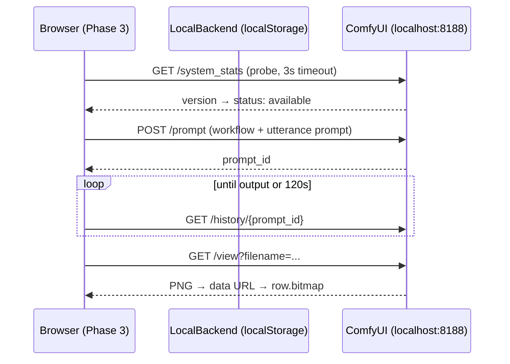

# Local Generation Design (ComfyUI backend)

Companion to `specs/local-generation.allium`. The spec defines behaviour; this
document records the backend choice, the API mechanics, the browser security
constraints, and the migration path toward a fully packaged local model.

## Why

Three motivations, in order of research relevance. Data sovereignty: a local
pipeline keeps utterances and images on the machine, which matters in school
contexts (minors' data) and in offline or poorly connected settings. Cost:
zero marginal cost per pictogram and no shared-quota 429s. Control: with
local models the style lever moves from the prompt to the model/LoRA choice —
a qualitatively different control point to expose to professionals, directly
relevant to the doctoral question of which controls produce better
pictograms.

## Backend choice: ComfyUI

ComfyUI over Automatic1111: actively maintained, API-first (the UI itself is
a client of the same API), runs on Apple Silicon via MPS, and models a
generation as an explicit workflow graph — which is exactly the right
abstraction for injecting a prompt into an otherwise fixed pipeline
(checkpoint + LoRA + sampler + size). A1111's `--api` mode remains a
compatible fallback (`POST /sdapi/v1/txt2img`) but is not the v1 target.

User-side setup (documented for workshop/tester onboarding):

1. Install ComfyUI (desktop app or `git clone` + `python main.py`).
2. Download a base checkpoint (SDXL or SD 1.5) and a flat-vector/icon style
   LoRA (search Civitai for "vector illustration LoRA" or "flat icon LoRA";
   check each model's licence before workshop use).
3. Launch with the API reachable and CORS open to the app origin:
   `python main.py --listen 127.0.0.1 --enable-cors-header "https://next.pictos.net"`
4. In pictos.net: Configuración avanzada > Backend local > endpoint
   `http://localhost:8188` > Probar conexión.

## API mechanics (ComfyUI)

Health probe: `GET /system_stats` (fast, returns version info; the spec's
`probe_local`). Generation is queue-based:

1. `POST /prompt` with `{"prompt": <workflow graph JSON>, "client_id": <uuid>}`
   → returns `{"prompt_id": "..."}`. The workflow graph is our canonical
   template with two substitutions: the positive prompt text and the seed.
2. Poll `GET /history/{prompt_id}` until it contains outputs (or listen on
   the websocket `/ws?clientId=`; polling is simpler and consistent with the
   rest of the app).
3. `GET /view?filename={f}&subfolder={s}&type=output` → PNG bytes → data URL.

The canonical workflow template (checkpoint loader → LoRA loader → CLIP text
encode positive/negative → KSampler → VAE decode → save image) ships in the
repo as JSON with placeholder model names; the settings panel lets the user
substitute the checkpoint and LoRA filenames it finds via `GET /object_info`
(which lists the models actually installed). This resolves the spec's
WorkflowTemplate open question toward the opinionated option, with a
just-enough escape hatch.

## Browser security constraints

Two gates must open for a https page to call localhost:

CSP: `netlify.toml` `connect-src` must include the local endpoint. Since the
endpoint is user-configurable, the practical policy is to allow the loopback
family explicitly: `http://localhost:* http://127.0.0.1:*`. LAN endpoints
(e.g. a shared workshop server at `http://192.168.x.x`) would require a CSP
change per deploy — out of scope for v1, noted for the taller scenario.

Mixed content: Chromium and Firefox treat `http://localhost` /
`http://127.0.0.1` as potentially trustworthy origins, so the https app may
fetch them. Safari historically does not — Safari users need the local
fallback (`npm run dev`) or a tunnel. Document this limitation in the UI
copy next to the endpoint field.

CORS is handled server-side by `--enable-cors-header` (step 3 above);
`/view` and `/prompt` both honour it.

## Architecture mapping

Implementation surface (v1): `services/localGenerationService.ts` (probe,
generate, workflow templating — mirrors `geminiService.generateImage`
signature so `App.tsx` dispatch stays a one-line addition);
`GenerationModel` gains `local-comfyui` with family `local`;
`INOPERATIVE_GENERATION_MODELS` gating reused for the not-available state;
settings panel gains the endpoint field + probe button; CSP change in
`netlify.toml`. No Netlify function, no quota call, no audit record.

## Migration path (fase local puro)

Deferred until UX and LoRA quality are validated. Two viable routes, both
requiring the LoRA merged into the checkpoint first:

In-browser: WebGPU via ONNX Runtime Web with a distilled model (SD-Turbo
class), roughly 1-2 GB fetched once and cached; works on modern desktops,
excludes older hardware and most tablets. Desktop app: Tauri wrapper
bundling stable-diffusion.cpp; heavier to distribute but predictable
performance and true offline installation — likely the better fit for
school deployments. Decision postponed; tracked as PackagedModel in the
spec.

## Out of scope for v1

A1111 support, LAN/shared backends, local NLU (Phases 1-2 stay on Claude via
Netlify), local vectorization toggle (VTracer reintroduction — tracked as
LocalVectorize in the spec), and any model download management inside the app.
