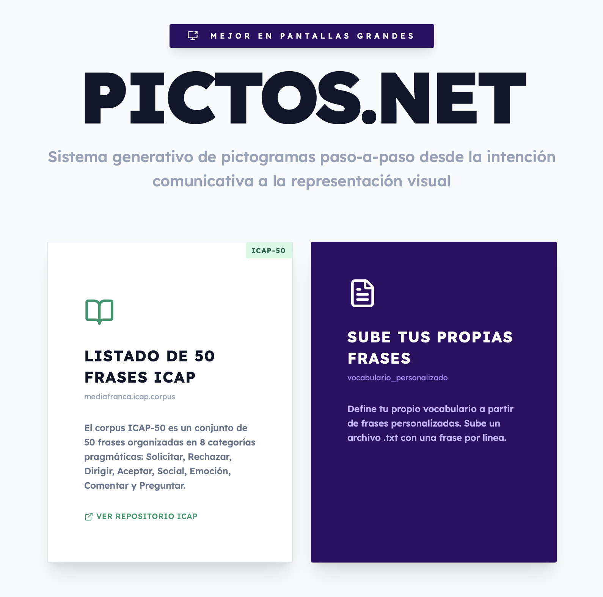
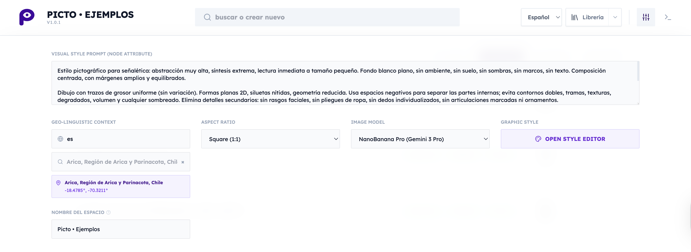
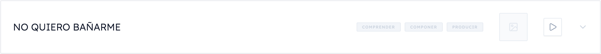
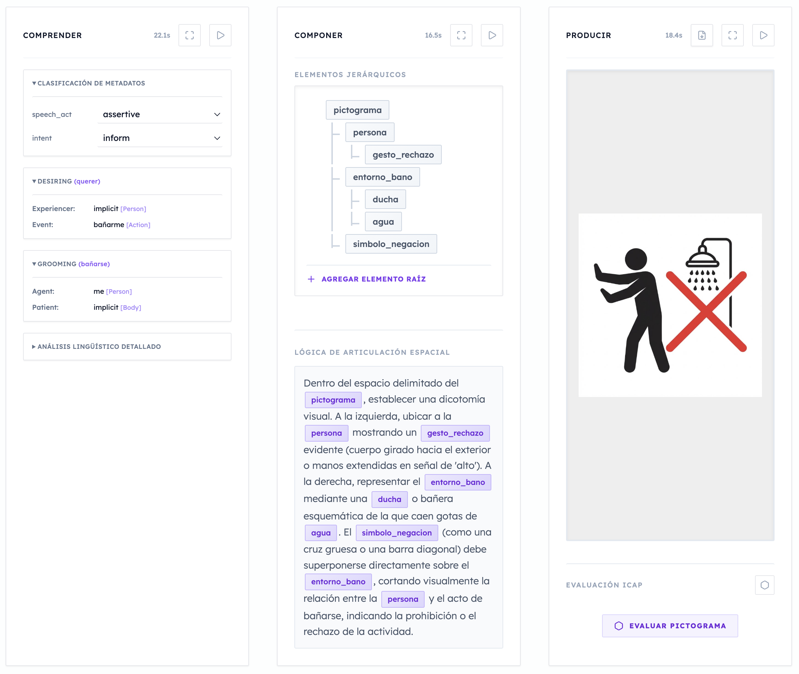
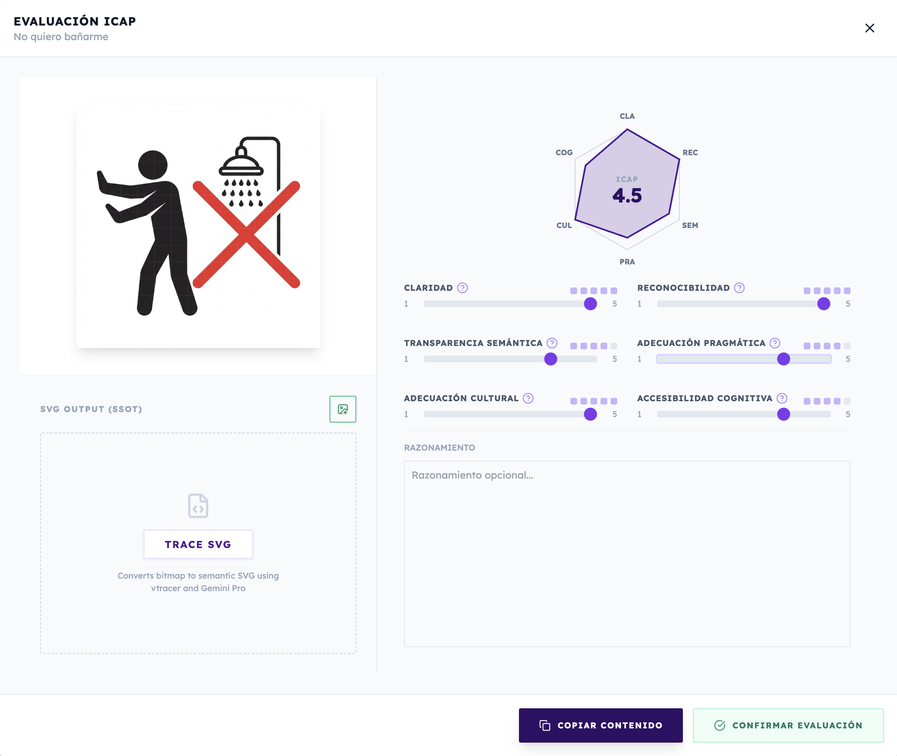

# Tutorial PICTOS.NET

## Guía Completa de Uso - v1.0.1

## Índice

1. [Introducción](#introducción)
2. [Primeros Pasos](#primeros-pasos)
3. [Configuración del Espacio](#configuración-del-espacio)
4. [El Prompt General de Estilo Visual](#el-prompt-general-de-estilo-visual)
5. [Generación en Cascada](#generación-en-cascada)
6. [Generación Paso por Paso](#generación-paso-por-paso)
7. [Edición y Regeneración de Pasos Intermedios](#edición-y-regeneración-de-pasos-intermedios)
8. [Evaluación ICAP](#evaluación-icap)
9. [Gestión de la Biblioteca SVG](#gestión-de-la-biblioteca-svg)
10. [Consejos y Buenas Prácticas](#consejos-y-buenas-prácticas)

## Introducción

**PICTOS.NET** es un sistema generativo semántico de pictogramas diseñado para crear representaciones visuales accesibles a partir de lenguaje natural. Utiliza un *pipeline* (o cadena de razonamiento) de 3 fases que transforma texto en pictogramas estructurados siguiendo los principios de accesibilidad cognitiva (AAC).

### ¿Qué hace PICTOS.NET?

Convierte frases en lenguaje natural (intención comunicativa) en pictogramas mediante:

1. **COMPRENDER** → Análisis semántico profundo (NLU)
2. **COMPONER** → Generación de jerarquía visual y composición espacial
3. **PRODUCIR** → Renderizado de imagen bitmap y vectorización

### Tecnología

- **Modelos de IA**: Google Gemini (3 Pro Preview, 2.5 Flash Image, 3 Pro Image)
- **Análisis Semántico**: Natural Semantic Metalanguage (NSM)
- **Validación**: Sistema de evaluación ICAP-50

## Primeros Pasos

### Pantalla de Inicio (HOME)



Al abrir PICTOS.NET, verás la pantalla principal con dos opciones:

#### 1. Cargar ICAP-50

El **ICAP-50** es un corpus canónico de 50 frases diseñadas para cubrir las dimensiones fundamentales de comunicación aumentativa:

- Necesidades básicas
- Emociones
- Acciones cotidianas
- Relaciones sociales
- Conceptos temporales y espaciales

**Cómo usar:**
1. Haz clic en el botón "Cargar ICAP-50"
2. Se cargarán automáticamente las 50 frases base
3. Serás redirigido a la pantalla de trabajo (LIST)

El índice **ICAP** es un módulo independiente que está documentado y disponible de forma separada acá: [https://github.com/mediafranca/ICAP](https://github.com/mediafranca/ICAP).

#### 2. Importar Frases Personalizadas

Puedes cargar tus propias frases desde un archivo de texto:

**Formato del archivo:**
```
Una frase por línea
Otra frase aquí
Y otra más
```

**Pasos:**
1. Prepara un archivo `.txt` con tus frases (una por línea)
2. Haz clic en "Importar Frases Personalizadas"
3. Selecciona tu archivo
4. Las frases se agregarán a tu espacio de trabajo

## Configuración del Espacio

### ¿Qué es un "Espacio"?

Un **Espacio** es tu colección de pictogramas con una configuración global compartida. Piensa en él como una "biblioteca" con un estilo visual coherente.

### Acceder a la Configuración

1. En la pantalla LIST, localiza el ícono de **deslizadores** () en la barra superior
2. Haz clic para abrir el panel de configuración
3. Verás 6 campos editables



### Campos de Configuración

#### 1. **Space Name** (Nombre del Espacio)
- Identificador de tu biblioteca
- Ejemplo: "Pictogramas para la Escuela", "AAC Hospital", "PICTOS.NET"
- Se muestra en la cabecera de la aplicación

#### 2. **Visual Style Prompt** (Prompt de Estilo Visual Global)
- **¡MUY IMPORTANTE!** Este es el prompt general que define el estilo de todos tus pictogramas
- Ver sección dedicada más abajo
- Ejemplo por defecto:
  ```
  Siluetas sobre un fondo blanco plano. Sin degradados, sin sombras,
  sin texturas. Líneas limpias y formas simples. Alto contraste.
  Estilo minimalista y universal.
  ```

#### 3. **Geo-Linguistic Context** (Contexto Geográfico-Lingüístico)
- Define el contexto cultural y geográfico para la interpretación semántica
- Incluye:
  - Latitud y longitud
  - Región (ciudad/país)
- Ejemplo: `-33.4489, -70.6693, Santiago, Chile`
- Afecta la interpretación de conceptos culturalmente situados

#### 4. **Aspect Ratio** (Relación de Aspecto)
- Formato de las imágenes generadas
- Opciones:
  - `1:1` - Cuadrado (recomendado para pictogramas)
  - `3:4` - Vertical
  - `4:3` - Horizontal
  - `16:9` - Panorámico horizontal
  - `9:16` - Panorámico vertical

#### 5. **Image Model** (Modelo de Generación)
- Selecciona el modelo de IA para generar imágenes:
  - **Flash** (Gemini 2.5 Flash): Más rápido, menor costo
  - **Pro** (Gemini 3 Pro Image): Más lento, mayor calidad y coherencia
- Recomendación: Flash para pruebas, Pro para producción

#### 6. **Graphic Style Editor** (Editor de Estilos Gráficos)
- Abre el editor visual de estilos SVG
- Define paletas de colores y estilos CSS
- Para usuarios avanzados

### Guardar Configuración

Los cambios se guardan automáticamente en tu navegador (localStorage). La configuración persiste entre sesiones.

## El Prompt General de Estilo Visual

### ¿Por qué es importante?

El **Visual Style Prompt** es el elemento más crítico de la configuración porque:

1. Define la **identidad visual coherente** de toda tu biblioteca
2. Se aplica a **todos** los pictogramas generados
3. Guía al modelo de IA en decisiones estéticas y de composición
4. Asegura **consistencia** entre pictogramas diferentes

### Cómo funciona

Cuando PICTOS.NET genera una imagen (Fase 3: PRODUCIR), combina:

```
Prompt Final =
  Contexto semántico del pictograma +
  Elementos visuales jerárquicos +
  Composición espacial +
  PROMPT GENERAL DE ESTILO VISUAL ← ¡Aquí!
```

### Ejemplos de Prompts Efectivos

#### Estilo Minimalista (por defecto)
```
Siluetas sobre un fondo blanco plano. Sin degradados, sin sombras,
sin texturas. Líneas limpias y formas simples. Alto contraste.
Estilo minimalista y universal.
```

#### Estilo Ilustrativo
```
Ilustraciones coloridas con líneas gruesas negras. Colores planos
vibrantes. Estilo similar a pictogramas educativos. Fondo blanco.
Formas redondeadas y amigables.
```

#### Estilo Técnico
```
Diagramas técnicos con líneas finas. Colores primarios puros (rojo,
azul, amarillo). Fondo blanco. Perspectiva isométrica cuando sea
relevante. Estilo preciso y geométrico.
```

#### Estilo Infantil
```
Dibujos simples con líneas gruesas. Colores pastel suaves. Formas
redondeadas sin esquinas agudas. Expresiones faciales amigables.
Estilo cálido y acogedor. Fondo blanco o crema claro.
```

### Elementos clave a incluir

Un buen prompt de estilo debe especificar:

1. **Fondo**: Color y textura (ej: "fondo blanco plano")
2. **Líneas**: Grosor y estilo (ej: "líneas gruesas negras", "contornos finos")
3. **Color**: Paleta y uso (ej: "colores planos", "monocromático", "paleta vibrante")
4. **Forma**: Geometría (ej: "formas redondeadas", "geometría angular")
5. **Contraste**: Nivel (ej: "alto contraste", "colores suaves")
6. **Estilo referencial**: Inspiración (ej: "estilo ARASAAC", "estilo de señalética")
7. **Prohibiciones**: Qué evitar (ej: "sin degradados", "sin sombras", "sin texturas")

### Modificar el Prompt General

1. Abre la configuración del espacio (ícono )
2. Localiza el campo "Visual Style Prompt"
3. Edita el texto según tu necesidad
4. Los cambios afectarán **solo** a pictogramas generados **después** del cambio
5. Para actualizar pictogramas existentes, deberás **regenerar** la Fase 3 (PRODUCIR)

## Generación en Cascada

### ¿Qué es la generación en cascada?

Es la ejecución **completa y automática** del pipeline de 3 fases:

```
UTTERANCE → [FASE 1] → NLU → [FASE 2] → VISUAL → [FASE 3] → BITMAP
```

### Cuándo usar

- Cuando quieres generar un pictograma completo de una sola vez
- Para procesamiento masivo de múltiples frases
- Cuando confías en que el análisis automático será adecuado

### Cómo ejecutar

#### Método 1: Fila Individual


Para ejecutar la generación del pictograma de forma completa (todos los pasos "en cascada") se debe presionar el botón "play" de la fila: 


1. En la pantalla LIST, localiza la fila del pictograma que deseas generar
2. Identifica el botón **▶ Play** en el extremo derecho de la fila
3. Haz clic en el botón
4. Observa el progreso en los 3 badges de estado:

   ```
   [COMPRENDER: idle → processing → completed]
   [COMPONER: idle → processing → completed]
   [PRODUCIR: idle → processing → completed]
   ```

5. Al finalizar, verás la miniatura del pictograma generado con un badge de score ICAP

#### Método 2: Batch Processing (múltiples filas)

Actualmente, PICTOS.NET procesa filas individualmente. Para procesar múltiples:

1. Haz clic en Play en la primera fila
2. Espera a que complete
3. Continúa con la siguiente fila

### Flujo Interno de la Cascada

Cuando ejecutas cascada, ocurre lo siguiente:

**Paso 1 - COMPRENDER** (20-30 segundos)
- Análisis semántico NSM del utterance
- Generación de estructura NLU:
  - Marcos semánticos (frames)
  - Explicitaciones NSM
  - Forma lógica
  - Pragmática
  - Guías visuales

**Paso 2 - COMPONER** (20-30 segundos)
- Generación de jerarquía de elementos visuales
- Creación de composición espacial (prompt)
- Decisiones sobre qué representar y cómo organizarlo

**Paso 3 - PRODUCIR** (10-25 segundos con Flash, 15-35 con Pro)
- Renderizado de imagen bitmap
- Generación PNG en base64
- Visualización en miniatura

**Resultado**
- Fila marcada como "completed"
- Evaluación en estado "idle" (lista para evaluar manualmente)

### Estados posibles

Durante y después de la cascada, verás estos estados:

- **idle** (gris): Paso no iniciado
- **processing** (azul animado): Ejecutándose
- **completed** (verde): Completado con éxito
- **error** (rojo): Falló
- **outdated** (naranja): Desactualizado (necesita regeneración)

### Manejo de Errores

Si alguna fase falla:
1. La cascada se detiene
2. El badge del paso se marca como "error" (rojo)
3. Los pasos siguientes permanecen en "idle"
4. Puedes:
   - Revisar el error en la consola (botón Console en cabecera)
   - Intentar regenerar solo ese paso
   - Editar manualmente el input del paso fallido

## Generación Paso por Paso


Puedes inspeccionar, modificar y reproducir diferentes pasos del pictograma. Una vez que modificas un paso, el paso siguiente queda desconectado lógicamente y debes producir los pasos seguientes de forma manual.

### ¿Qué es la generación paso por paso?

Es la ejecución **individual** de cada fase del pipeline, con control manual entre pasos. Permite **intervenir y editar** entre fases.

### Cuándo usar

- Cuando quieres **supervisar** cada fase
- Para **ajustar manualmente** análisis semánticos o composiciones visuales
- Cuando el resultado de cascada no es satisfactorio
- Para **experimentar** con diferentes configuraciones

### Cómo ejecutar

#### 1. Expandir la fila

Haz clic en cualquier parte de la fila (excepto en botones) para expandir la vista detallada. Verás 3 columnas:

```
┌─────────────┬─────────────┬─────────────┐
│ COMPRENDER  │  COMPONER   │  PRODUCIR   │
│   (NLU)     │  (VISUAL)   │  (BITMAP)   │
└─────────────┴─────────────┴─────────────┘
```

#### 2. Ejecutar Fase 1: COMPRENDER

**Ubicación:** Primera columna (izquierda)

**Botones disponibles:**
- **▶ Regenerar**: Ejecuta análisis NLU
- **◼ Detener**: Cancela ejecución en curso
- **⛶ Enfoque**: Abre en pantalla completa

**Proceso:**
1. Haz clic en "▶ Regenerar" en el StepBox "COMPRENDER"
2. El badge cambiará a "processing" (azul)
3. Espera 3-5 segundos
4. Al completar, verás el análisis NLU:
   - **Utterance original**
   - **Idioma detectado**
   - **Frames semánticos** (predicados, roles)
   - **NSM Explications** (descomposición en primitivos semánticos)
   - **Forma lógica**
   - **Pragmática**
   - **Visual Guidelines** (guías para representación visual)

**Revisar resultado:**
- Examina si el análisis semántico es correcto
- Verifica que los frames capturan la intención comunicativa
- Comprueba que las visual guidelines son apropiadas

#### 3. Ejecutar Fase 2: COMPONER

**Ubicación:** Segunda columna (centro)

**Pre-requisito:** Fase 1 debe estar "completed"

**Botones disponibles:**
- **▶ Regenerar**: Ejecuta generación visual
- **◼ Detener**: Cancela ejecución
- **⛶ Enfoque**: Abre en pantalla completa
- **↻ Regenerar Prompt** (aparece si editas elementos)

**Proceso:**
1. Haz clic en "▶ Regenerar" en el StepBox "COMPONER"
2. El badge cambiará a "processing" (azul)
3. Espera 4-7 segundos
4. Al completar, verás:
   - **Jerarquía de Elementos Visuales** (árbol expandible)
   - **Prompt Espacial** (descripción de la composición)

**Estructura de elementos:**
```
📁 root
  └─ 📄 figura_humana
      ├─ type: "figure"
      ├─ semanticRole: "agent"
      ├─ salience: 1.0
      └─ children: [...]
  └─ 📄 objeto_comida
      ├─ type: "object"
      ├─ semanticRole: "patient"
      └─ salience: 0.8
```

**Revisar resultado:**
- ¿Los elementos representan correctamente el concepto?
- ¿La jerarquía es lógica?
- ¿El prompt espacial describe bien la composición?

#### 4. Ejecutar Fase 3: PRODUCIR

**Ubicación:** Tercera columna (derecha)

**Pre-requisito:** Fase 2 debe estar "completed"

**Botones disponibles:**
- **▶ Regenerar**: Ejecuta generación de imagen
- **◼ Detener**: Cancela ejecución
- **⛶ Enfoque**: Abre en pantalla completa
- **↓ Descargar**: Descarga PNG
- **⟳ Re-trace SVG**: Vectoriza bitmap
- **⚙ Procesar SVG**: Estructura SVG

**Proceso:**
1. Haz clic en "▶ Regenerar" en el StepBox "PRODUCIR"
2. El badge cambiará a "processing" (azul)
3. Espera:
   - Flash: 8-15 segundos
   - Pro: 15-30 segundos
4. Al completar, verás:
   - **Imagen bitmap generada**
   - **Evaluación ICAP** (formulario de 6 dimensiones)

**Revisar resultado:**
- ¿La imagen representa correctamente el concepto?
- ¿El estilo visual es consistente con tu prompt general?
- ¿Es accesible y comprensible?

### Ventajas de Paso por Paso

1. **Control granular**: Intervención en cada fase
2. **Iteración eficiente**: Regenera solo lo necesario
3. **Aprendizaje**: Comprende cómo funciona el pipeline
4. **Calidad**: Ajusta hasta obtener el resultado óptimo

## Edición y Regeneración de Pasos Intermedios

Esta es una de las funcionalidades más poderosas de PICTOS.NET: **editar resultados intermedios y regenerar solo los pasos downstream**.

### Sistema de Invalidación en Cascada

Cuando editas un paso, PICTOS.NET automáticamente marca como "outdated" (obsoleto) todos los pasos siguientes:

```
Editas NLU
  ↓
COMPONER → outdated (naranja)
PRODUCIR → outdated (naranja)

Editas VISUAL (elements/prompt)
  ↓
PRODUCIR → outdated (naranja)
```

### Escenario 1: Corregir Análisis Semántico (NLU)

**Situación:** El análisis NLU interpretó mal la frase.

**Ejemplo:**
- Utterance: "Quiero tomar agua"
- NLU detecta frame "DESIRE" (deseo) pero falta el objeto "agua"

**Pasos para corregir:**

1. **Expandir la fila** para ver la vista detallada
2. **Haz clic en el ícono "⛶ Enfoque"** en el StepBox COMPRENDER
3. Se abrirá el **SmartNLUEditor** en pantalla completa
4. **Edita el JSON** del NLU:
   - Localiza `frames`
   - Agrega el objeto faltante:
   ```json
   {
     "frames": [
       {
         "type": "DESIRE",
         "predicate": "want",
         "roles": {
           "experiencer": "I",
           "stimulus": "water"  ← agregar
         }
       }
     ]
   }
   ```
5. **Guarda** (botón "Guardar" o Ctrl+S)
6. **Cierra** el modal (botón X o Escape)
7. **Observa** que los badges COMPONER y PRODUCIR ahora están en "outdated" (naranja)
8. **Regenera COMPONER**: Haz clic en "▶ Regenerar" en el StepBox COMPONER
9. **Revisa** el nuevo resultado visual
10. **Regenera PRODUCIR**: Haz clic en "▶ Regenerar" en el StepBox PRODUCIR
11. **Evalúa** el nuevo pictograma

### Escenario 2: Ajustar Jerarquía de Elementos

**Situación:** Los elementos visuales son correctos, pero la jerarquía o propiedades no.

**Ejemplo:**
- Pictograma de "comer manzana"
- La manzana tiene `salience: 0.5` pero debería ser más prominente

**Pasos para corregir:**

1. **Expandir la fila**
2. **Haz clic en "⛶ Enfoque"** en el StepBox COMPONER
3. Se abrirá el **ElementsEditor** en pantalla completa
4. **Edita la jerarquía**:
   - Expande el árbol de elementos
   - Localiza el elemento "apple"
   - Edita `salience: 0.5` → `salience: 0.9`
   - También puedes editar:
     - `type`: "object", "figure", "action", "abstract", "location"
     - `semanticRole`: "agent", "patient", "instrument", "location"
     - `visualAttributes`: ["color: red", "size: large"]
5. **Guarda los cambios**
6. **Observa el botón "↻ Regenerar Prompt Espacial"**
   - Este botón aparece cuando editas elements
   - Permite regenerar solo el prompt sin re-generar los elementos
7. **Opciones:**
   - **Opción A**: Regenerar solo el prompt:
     - Haz clic en "↻ Regenerar Prompt Espacial"
     - Espera 3-5 segundos
     - Revisa el nuevo prompt
     - Luego regenera PRODUCIR
   - **Opción B**: Regenerar todo COMPONER:
     - Haz clic en "▶ Regenerar" (regenera elements + prompt)
     - Pierde tus ediciones manuales
8. **Regenera PRODUCIR** para ver el resultado final

### Escenario 3: Refinar Composición Espacial (Prompt)

**Situación:** Los elementos son correctos, pero la composición espacial no.

**Ejemplo:**
- Pictograma de "dar abrazo"
- Elementos: 2 figuras
- Prompt actual: "Dos figuras de pie, separadas"
- Deseado: "Dos figuras abrazándose, cercanas, tocándose"

**Pasos para corregir:**

1. **Expandir la fila**
2. **En el StepBox COMPONER**, localiza el campo de texto **"Prompt Espacial"**
3. **Edita directamente** el prompt:
   ```
   Dos figuras humanas estilizadas, posicionadas de frente,
   en contacto físico, con brazos extendidos en gesto de abrazo.
   Composición centrada, figuras ocupan 80% del encuadre.
   ```
4. Los cambios se guardan automáticamente
5. **Observa** que el badge PRODUCIR cambia a "outdated"
6. **Regenera PRODUCIR**
7. **Compara** el resultado con la versión anterior

### Escenario 4: Variaciones del Bitmap

**Situación:** Quieres explorar diferentes versiones del bitmap **sin cambiar** NLU ni VISUAL.

**Pasos:**

1. **En el StepBox PRODUCIR**, simplemente haz clic en **"▶ Regenerar"**
2. Espera a que se genere una **nueva variación**
3. **Compara** con la anterior
4. **Repite** hasta encontrar la versión óptima

**Nota:** Cada regeneración produce una variante diferente porque los modelos de IA tienen aleatoriedad inherente.

### Escenario 5: Corrección a Medio Pipeline

**Situación:** Ya ejecutaste cascada completa, pero el resultado no es bueno en la Fase 2.

**Pasos:**

1. **Expandir la fila**
2. **Editar COMPONER** (elements o prompt) según necesites
3. **NO regeneres COMPONER** si solo quieres ajustes finos al prompt
4. **Regenera solo PRODUCIR**
5. Si el resultado sigue siendo insatisfactorio:
   - Vuelve a editar COMPONER
   - O regenera COMPONER completo
   - Luego regenera PRODUCIR

### Mejores Prácticas para Edición

1. **Edita de arriba hacia abajo**: Primero NLU, luego VISUAL, luego PRODUCIR
2. **Ediciones granulares**: Cambia una cosa a la vez para identificar efectos
3. **Guarda versiones**: Si tienes un resultado bueno, descarga el PNG antes de experimentar
4. **Documenta cambios**: Anota qué editaste y por qué (útil para aprendizaje)
5. **Itera conservadoramente**: Pequeños ajustes producen mejores resultados que cambios radicales

### Teclas de Atajo

Cuando estés en el editor de enfoque (modal pantalla completa):

- **Escape**: Cerrar modal
- **Ctrl+S** (Windows/Linux) o **Cmd+S** (Mac): Guardar cambios
- **Tab**: Navegar entre campos

## Evaluación ICAP



### ¿Qué es ICAP?

**ICAP** (Image-Communication Accessibility Protocol) es un sistema de evaluación de pictogramas basado en 6 dimensiones:

1. **Clarity** (Claridad visual)
2. **Recognizability** (Reconocibilidad)
3. **Semantic Transparency** (Transparencia semántica)
4. **Pragmatic Fit** (Ajuste pragmático)
5. **Cultural Adequacy** (Adecuación cultural)
6. **Cognitive Accessibility** (Accesibilidad cognitiva)

Cada dimensión se evalúa en escala **Likert de 1 a 5**:
- 1 = Muy deficiente
- 2 = Deficiente
- 3 = Aceptable
- 4 = Bueno
- 5 = Excelente

### ¿Por qué evaluar?

La evaluación ICAP:
- **Valida** la calidad del pictograma
- **Filtra** pictogramas para la biblioteca SVG (solo ≥4.0 se guardan)
- **Documenta** decisiones de diseño
- **Guía** iteraciones de mejora

### Cómo evaluar

#### Método 1: En la Vista Detallada

1. **Expande la fila** del pictograma
2. **Localiza el StepBox PRODUCIR** (tercera columna)
3. **Scroll hacia abajo** dentro del StepBox
4. Verás el **Evaluation Editor** con 6 dimensiones

#### Método 2: En Modo Enfoque

1. **Expande la fila**
2. **Haz clic en "⛶ Enfoque"** en el StepBox PRODUCIR
3. Se abrirá pantalla completa con:
   - Imagen bitmap grande
   - Formulario de evaluación
   - **HexagonChart** (gráfico radar hexagonal)

#### Proceso de Evaluación

**Paso 1: Visualización**
- Observa el pictograma generado
- Compara con el utterance original
- Considera el contexto de uso (audiencia, propósito)

**Paso 2: Evaluación por Dimensión**

Para cada dimensión, desliza el slider de 1 a 5:

**A) Clarity (Claridad Visual)**
- ¿Las formas son nítidas y bien definidas?
- ¿Hay ruido visual o elementos confusos?
- ¿El contraste es adecuado?
- **5**: Imagen cristalina, formas perfectas
- **3**: Algunas áreas confusas pero mayormente claro
- **1**: Imagen borrosa, formas indefinidas

**B) Recognizability (Reconocibilidad)**
- ¿Se identifican claramente los elementos representados?
- ¿Una persona puede nombrar lo que ve?
- **5**: Todos los elementos son inmediatamente identificables
- **3**: La mayoría se reconocen con algo de esfuerzo
- **1**: Elementos irreconocibles

**C) Semantic Transparency (Transparencia Semántica)**
- ¿La relación entre la imagen y el significado es evidente?
- ¿Alguien que no habla el idioma puede inferir el significado?
- **5**: Significado inmediatamente obvio
- **3**: Se requiere contexto para comprender
- **1**: No hay conexión aparente con el significado

**D) Pragmatic Fit (Ajuste Pragmático)**
- ¿El pictograma es apropiado para el contexto de uso?
- ¿Captura la intención comunicativa (no solo el significado literal)?
- **5**: Perfecto para el contexto y uso previsto
- **3**: Funciona pero no es ideal
- **1**: Inapropiado para el contexto

**E) Cultural Adequacy (Adecuación Cultural)**
- ¿El pictograma es culturalmente apropiado para tu contexto geográfico?
- ¿Evita estereotipos o representaciones ofensivas?
- ¿Refleja la diversidad?
- **5**: Culturalmente neutral o apropiado
- **3**: Algunos elementos culturalmente específicos
- **1**: Culturalmente inapropiado u ofensivo

**F) Cognitive Accessibility (Accesibilidad Cognitiva)**
- ¿Personas con diferentes capacidades cognitivas pueden comprenderlo?
- ¿Es simple sin ser simplista?
- ¿Evita metáforas complejas?
- **5**: Accesible para todos los niveles cognitivos
- **3**: Requiere capacidad cognitiva moderada
- **1**: Demasiado complejo o abstracto

**Paso 3: Revisión del Score**

- El **score promedio** se calcula automáticamente
- Se muestra en el badge junto a la miniatura
- **Score ≥ 4.0**: Calidad suficiente para biblioteca SVG
- **Score < 4.0**: Necesita mejora

**Paso 4: Guardar Evaluación**

- Los cambios se guardan automáticamente
- El badge de la fila se actualiza con el score
- El estado de evaluación cambia de "idle" a "completed"

### Visualización: HexagonChart

En modo enfoque, verás un **gráfico radar hexagonal** que visualiza las 6 dimensiones:

```
         Clarity
           /\
          /  \
 Cultural  ▓  Recogniz.
         \▓▓/
      Cognitive
```

- Permite identificar **rápidamente** puntos débiles
- Un hexágono **regular y grande** indica alta calidad
- Un hexágono **irregular o pequeño** indica áreas a mejorar

### Re-evaluación

Puedes re-evaluar en cualquier momento:

1. Edita los sliders
2. El score se recalcula automáticamente
3. La evaluación se actualiza

**Nota:** Si regeneras el BITMAP, la evaluación se **resetea** a "idle" (debes evaluar nuevamente).

## Gestión de la Biblioteca SVG

### ¿Qué es la Biblioteca SVG?

Es una colección de **pictogramas vectoriales estructurados** que cumplen con:
- **Score ICAP ≥ 4.0**
- **Formato mf-svg-schema** (MediaFranca SVG Schema)
- Metadatos semánticos embebidos

### Flujo de Creación de SVG

Cuando un pictograma bitmap cumple los criterios, puedes vectorizarlo:

```
BITMAP (PNG) → [Re-trace] → RAW SVG → [Process] → STRUCTURED SVG → Biblioteca
```

#### Paso 1: Re-trace (Vectorización)

**Función:** Convierte bitmap (PNG) en vectores SVG

**Proceso:**
1. **Expandir la fila** del pictograma evaluado (score ≥4.0)
2. **En StepBox PRODUCIR**, localiza el botón **"⟳ Re-trace SVG"**
3. **Haz clic**
4. Espera 3-8 segundos (usa vtracer, procesamiento local)
5. Se genera **rawSvg** (SVG sin estructura semántica)

**Resultado:**
- SVG vectorizado con paths y formas
- Sin metadatos semánticos aún
- Aparece el botón "⚙ Procesar SVG"

#### Paso 2: Process (Estructuración Semántica)

**Función:** Enriquece el SVG con metadatos semánticos

**Proceso:**
1. **Después de Re-trace**, localiza el botón **"⚙ Procesar SVG"**
2. **Haz clic**
3. Espera 5-10 segundos (llama a Gemini API)
4. Se genera **structuredSvg** con:
   - Grupos semánticos (`<g id="agent">`, `<g id="patient">`)
   - Metadatos ICAP
   - Roles semánticos
   - Estilos aplicados

**Resultado:**
- SVG estructurado según mf-svg-schema
- **Automáticamente agregado** a la biblioteca SVG
- Guardado en localStorage (`pictonet_v19_svg_library`)

### Acceso a la Biblioteca

#### Visualizar Biblioteca

1. **En la barra superior**, localiza el botón **"Library"** (📚)
2. **Haz clic** para abrir el dropdown
3. Selecciona **"Ver Biblioteca SVG"**
4. Se abrirá modal con:
   - Miniaturas de SVG estructurados
   - Utterance original
   - Score ICAP
   - Botones de acción (descargar, eliminar)

#### Exportar Biblioteca

1. **Abre el dropdown "Library"**
2. Selecciona **"Exportar Biblioteca SVG"**
3. Se descargará un archivo **JSON** con:
   - Todos los SVG estructurados
   - Metadatos completos
   - Configuración del espacio

**Formato de exportación:**
```json
{
  "version": "1.0.1",
  "exported": "2025-01-15T10:30:00Z",
  "config": { ... },
  "pictograms": [
    {
      "utterance": "Quiero agua",
      "structuredSvg": "<svg>...</svg>",
      "evaluation": { ... },
      "nlu": { ... }
    }
  ]
}
```

#### Importar Biblioteca

1. **Abre el dropdown "Library"**
2. Selecciona **"Importar Biblioteca SVG"**
3. **Selecciona archivo JSON** exportado previamente
4. Los pictogramas se **fusionan** con la biblioteca actual
5. **No se duplican** (se compara por utterance)

#### Limpiar Biblioteca

1. **Abre el dropdown "Library"**
2. Selecciona **"Limpiar Biblioteca SVG"**
3. **Confirma** la acción
4. Se eliminan **todos** los SVG estructurados
5. **Irreversible** (asegúrate de exportar antes si necesitas backup)

### Uso de SVG Estructurados

Los SVG de la biblioteca pueden:

1. **Descargarse individualmente**
   - Clic en botón "Descargar" en la vista de biblioteca
   - Archivo `.svg` listo para usar

2. **Editarse con software vectorial**
   - Inkscape, Adobe Illustrator, Figma
   - Los grupos semánticos facilitan edición selectiva

3. **Integrarse en sistemas AAC**
   - Los metadatos semánticos permiten búsqueda y categorización
   - Compatible con mf-svg-schema

4. **Re-utilizarse en PICTOS.NET**
   - Los metadatos permiten regeneración contextual
   - Pueden servir como base para variaciones

## Consejos y Buenas Prácticas

### 1. Configuración Inicial

- **Define tu prompt general** antes de generar pictogramas
- **Mantén consistencia** en el estilo durante un proyecto
- **Documenta tu configuración** (export/import para diferentes espacios)

### 2. Escritura de Utterances

**Buenas prácticas:**
- ✅ Frases simples y directas: "Quiero agua"
- ✅ Verbos en infinitivo o primera persona: "Comer", "Estoy feliz"
- ✅ Conceptos concretos mejor que abstractos
- ✅ Una idea por frase

**Evitar:**
- ❌ Frases complejas con múltiples cláusulas
- ❌ Ironía o sarcasmo
- ❌ Referencias muy específicas a cultura pop
- ❌ Ambigüedades sin contexto

### 3. Iteración Eficiente

**Estrategia recomendada:**
1. Ejecuta **cascada** primero (rápido, sin intervención)
2. **Revisa** resultados
3. Para los no satisfactorios:
   - Identifica en qué fase falló
   - Edita ese paso específico
   - Regenera solo downstream
4. **No regeneres** toda la cascada si solo necesitas ajustar un paso

### 4. Cuándo Usar Cada Modelo

**Gemini 2.5 Flash (flash)**
- Pruebas rápidas
- Iteración de conceptos
- Presupuesto limitado
- Utterances simples

**Gemini 3 Pro Image (pro)**
- Producción final
- Pictogramas complejos
- Máxima calidad requerida
- Biblioteca definitiva

### 5. Evaluación ICAP

**No seas demasiado estricto:**
- Score 4.0+ es suficiente para biblioteca
- Perfección (5.0 en todo) es rara
- Prioriza **usabilidad** sobre perfección estética

**Considera el contexto:**
- Un pictograma "Comer" para niños vs adultos puede diferir
- Ajusta tu evaluación al público objetivo
- Cultural Adequacy depende de tu geo-context

### 6. Gestión de Biblioteca

**Estrategia de backup:**
- Exporta tu biblioteca regularmente
- Nombra exports con fecha: `pictos_biblioteca_2025-01-15.json`
- Guarda en múltiples ubicaciones (nube + local)

**Calidad sobre cantidad:**
- Es mejor tener 50 pictogramas excelentes que 200 mediocres
- Regenera y mejora antes de agregar a biblioteca
- Elimina pictogramas obsoletos o de baja calidad

### 7. Troubleshooting Común

**Problema: NLU no detecta elementos clave**
- **Solución:** Edita manualmente el JSON NLU, agrega frames o roles faltantes

**Problema: Bitmap no refleja el prompt general**
- **Solución:** Verifica que el prompt general está guardado en config, regenera PRODUCIR

**Problema: Elementos visuales son incorrectos**
- **Solución:** Edita `elements` manualmente, ajusta types y semanticRoles

**Problema: Score ICAP bajo**
- **Solución:** Identifica dimensión débil en HexagonChart, edita paso correspondiente

**Problema: SVG re-trace falla**
- **Solución:** Asegúrate de que el bitmap tiene alto contraste, regenera con Pro si es necesario

### 8. Optimización de Tiempo

**Para procesamiento de ICAP-50:**
- Usa **flash** en primera pasada
- Evalúa solo los más prometedores
- Regenera con **pro** solo los aprobados
- Tiempo estimado: 2-3 horas para 50 pictogramas de calidad

### 9. Accesibilidad

**Recuerda los principios AAC:**
- **Simplicidad**: Menos es más
- **Contraste**: Alto para legibilidad
- **Tamaño**: Debe ser escalable sin perder claridad
- **Universalidad**: Evita simbolismo muy cultural
- **Consistencia**: Mantén estilo coherente

### 10. Experimentación

**No temas experimentar:**
- PICTOS.NET permite iteración sin límite
- Puedes regenerar cualquier paso sin perder todo
- Los cambios se guardan automáticamente
- Exporta versiones estables antes de experimentos radicales

## Resumen del Flujo de Trabajo Completo

```
1. CONFIGURAR ESPACIO
   └─ Definir prompt general, geo-context, aspect ratio, modelo

2. CARGAR UTTERANCES
   └─ ICAP-50 o archivo personalizado

3. GENERAR PICTOGRAMAS
   ├─ Cascada completa (rápido)
   └─ Paso por paso (control fino)

4. REVISAR Y EDITAR
   ├─ Examinar NLU, VISUAL, BITMAP
   ├─ Editar pasos intermedios
   └─ Regenerar solo lo necesario

5. EVALUAR ICAP
   └─ 6 dimensiones, score ≥4.0 para biblioteca

6. CREAR SVG ESTRUCTURADOS
   ├─ Re-trace bitmap → SVG
   └─ Process SVG → metadatos semánticos

7. GESTIONAR BIBLIOTECA
   ├─ Exportar backup
   ├─ Descargar SVG individuales
   └─ Limpiar obsoletos

8. ITERAR Y MEJORAR
   └─ Refinar configuración basado en resultados
```

## Recursos Adicionales

### Documentación Técnica

- **Esquema mf-svg-schema**: Formato de SVG estructurados
- **ICAP Protocol**: Protocolo de evaluación completo
- **NSM Theory**: Natural Semantic Metalanguage

### Soporte

- **GitHub**: [github.com/tu-repo/pictos-net](https://github.com)
- **Issues**: Reporta bugs o solicita features

### Licencia

PICTOS.NET es software de código abierto bajo licencia MIT.
Los pictogramas generados pueden licenciarse según configuración del espacio (ej: CC BY 4.0).

## Conclusión

PICTOS.NET es una herramienta poderosa para generar pictogramas accesibles basados en análisis semántico profundo. La clave para obtener resultados óptimos es:

1. **Configurar cuidadosamente** tu espacio (especialmente el prompt general)
2. **Iterar** usando la edición de pasos intermedios
3. **Evaluar rigurosamente** con ICAP
4. **Mantener** una biblioteca de alta calidad

Con práctica, podrás generar bibliotecas completas de pictogramas coherentes, accesibles y culturalmente apropiados.

**¡Buena suerte con tu generación de pictogramas!**

_Tutorial creado para PICTOS.NET v1.0.1 - Enero 2025_
