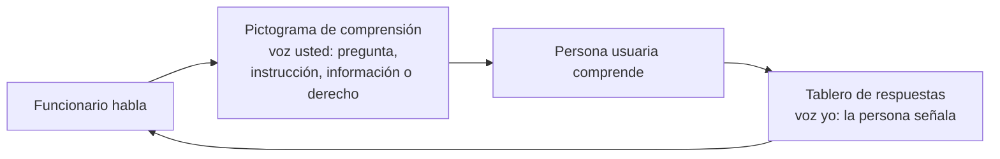

# Librería: Trámites Escolares Chile — Taller Mineduc

## Ficha

| Campo | Valor |
|---|---|
| Nombre | Trámites Escolares Chile — Taller Mineduc |
| Autor | Herbert Spencer González, e[ad] PUCV (investigación doctoral Pictos.net) |
| Corpus original | Ana María Torres, Coordinación Institucional Ley Autismo y Sordera, Seremi de Educación Región de Valparaíso, Mineduc[^1] |
| Licencia | CC BY-SA 4.0 |
| Idioma | es-419 |
| Contexto geográfico | Región de Valparaíso, Chile |
| Archivo importable | `tramites-escolares-chile.json` (Librerías > Importar) |
| Contenido | 38 pictogramas en 6 secuencias |

## Naturaleza de la librería

El corpus no es CAA expresiva clásica sino **apoyo visual transaccional**: pictogramas que sostienen una transacción entre una persona usuaria y el Estado (certificar estudios, matricular, reclamar). Cada intercambio tiene dos voces, y la librería cubre ambas:

Las secuencias 1 a 5 son la voz institucional descompuesta; la secuencia 6 es un tablero transversal de respuestas en primera persona, para que la persona no quede muda a mitad del trámite.

## Prompt general de estilo

Registrado en `visualStylePrompt` de la configuración:

> AAC pictogram style: bold uniform black outlines, flat solid colors, high contrast, simple geometric shapes, plain white background, one single clear focal scene per image, no text or letters inside the image, no gradients, no shadows, no decorative detail, generous white margins, front-facing perspective, in the visual convention of augmentative and alternative communication symbol sets

Complementado por `annotatedContext` (en español), que informa a la Fase 1 sobre el registro institucional, el trato de usted/yo y los perfiles de las personas usuarias.

## Reglas de descomposición aplicadas

1. **Una incógnita por pictograma.** "Indique cuál fue su último curso aprobado, en qué año y colegio" contiene tres preguntas; se separó en tres.
2. **Sin tácitos.** Se explicitan sujeto y objeto: "El colegio nos va a informar qué cursos aprobó usted", no "ellos nos informen su situación".
3. **Un acto comunicativo por enunciado.** La frase de la Superintendencia mezclaba calificación jurídica, competencia institucional y dirección física; se separó en cinco pasos.
4. **Cierre explícito.** Se agregaron pasos que el original daba por supuestos: "Nosotros le vamos a avisar cuando tengamos la respuesta", "Espere el resultado en la misma página web"[^2].
5. **Regla negativa visible.** "Ya no van directo a la escuela" se convirtió en paso propio: "Usted no debe ir al colegio a pedir la matrícula".
6. **Jerga desempaquetada en la sintaxis.** "Exámenes libres" se glosa dentro del enunciado: "¿Rindió usted exámenes libres, sin ir a clases?".

## Secuencias

### 1. Entrevista: certificación de estudios (7)

Original: "Necesito que me indique cual fue su ultimo curso aprobado, en que año y colegio" más las preguntas de modalidad y fines laborales.

1. ¿Cuál fue el último curso que usted aprobó en el colegio?
2. ¿En qué año aprobó usted ese último curso?
3. ¿Cómo se llama el colegio donde usted estudió?
4. ¿Iba usted al colegio a clases todos los días?
5. ¿Estudió usted en una sede social de su barrio?
6. ¿Rindió usted exámenes libres, sin ir a clases?
7. ¿Rindió usted exámenes de estudios para conseguir un trabajo?

### 2. Información: búsqueda de registros escolares (4)

Original: "Cuando no encontramos registros, nosotros nos comunicarnos con el colegio para que ellos nos informen su situación escolar".

1. No encontramos sus documentos de estudios en nuestro sistema.
2. Nosotros vamos a llamar a su colegio para pedir su información escolar.
3. El colegio nos va a informar qué cursos aprobó usted.
4. Nosotros le vamos a avisar a usted cuando tengamos la respuesta.

### 3. Derivación: reclamo por vulneración de derechos (5)

Original: la frase sobre la Superintendencia de Educación Escolar y su dirección en Viña del Mar.

1. Alguien no respetó sus derechos en el colegio.
2. La Superintendencia de Educación atiende este tipo de problemas.
3. Usted debe ir a la oficina de la Superintendencia de Educación en Viña del Mar.
4. La oficina está en calle Limache 3405, piso 3, oficina 38, sector El Salto, Viña del Mar.
5. En la oficina, una persona va a recibir su reclamo.

### 4. Procedimiento: postulación al Sistema de Admisión Escolar (10)

Original: la frase sobre solicitud de matrícula más el adjunto "Anotate en la lista" (6 pasos web).

1. Usted quiere matricular a un estudiante en un colegio.
2. Usted no debe ir al colegio a pedir la matrícula.
3. Usted debe postular por internet, en la página del Sistema de Admisión Escolar.
4. Entre a la página web sistemadeadmisionescolar.cl.
5. Haga clic en el botón que dice 'Ingresa aquí'.
6. Si usted no tiene una cuenta, haga clic en 'Regístrate aquí' y cree su cuenta.
7. Complete la información que le pide la página.
8. Haga clic en 'Añadir estudiante' y escriba los datos del estudiante.
9. Haga clic en 'Agregar establecimiento' y elija los colegios que usted prefiere.
10. Espere el resultado de la postulación en la misma página web.

### 5. Derecho: apoyos educativos para el estudiante (3)

Original: "Todos los establecimientos que reciben subvención del Estado deben atender estudiantes con necesidades educativas especiales... aunque no tengan Programa de Integracion Escolar".

1. Todos los colegios que reciben dinero del Estado deben aceptar a estudiantes que necesitan apoyos.
2. El colegio debe darle apoyos al estudiante, aunque el colegio no tenga Programa de Integración Escolar.
3. Si el colegio no le da los apoyos, usted puede reclamar en la Superintendencia de Educación[^3].

### 6. Tablero: respuestas de la persona usuaria (9)

Transversal a todas las secuencias; en primera persona, para señalar.

1. Sí.
2. No.
3. Yo no me acuerdo.
4. Yo no entiendo. Repita, por favor.
5. Yo necesito más tiempo para responder.
6. Yo quiero responder con ayuda de una persona de apoyo.
7. Yo aprobé un curso de educación básica.
8. Yo aprobé un curso de educación media.
9. Yo estudié en otro país[^4].

## Uso en el taller

Momento demostrativo: importar la librería, generar en vivo la secuencia SAE (contraste entre el adjunto en mayúsculas y su versión pictografiada) y una pregunta de certificación con su respuesta del tablero. Momento propositivo: entregar a los participantes las frases originales de Ana María en bruto y pedirles que las descompongan antes de generar; comparar sus descomposiciones con las de esta librería. La conversación prospectiva se abre con la pregunta: qué otros trámites de sus servicios merecen una librería como esta, y qué puntos de control necesitarían para construirla ellos mismos.

[^1]: Frases recibidas por correo electrónico en julio de 2026, junto al adjunto "Anotate en la lista.docx" con los pasos de registro en el SAE.
[^2]: Estos cierres no existen en el corpus original; son tácitos institucionales que la persona usuaria no puede inferir. Marcarlos en el taller como decisión editorial discutible.
[^3]: Este paso tampoco está en el original: conecta el derecho con el mecanismo de reclamo de la secuencia 3. Otra decisión editorial para discutir.
[^4]: Incluida por la realidad migrante frecuente en trámites de certificación de estudios; también es material de conversación para el taller.
